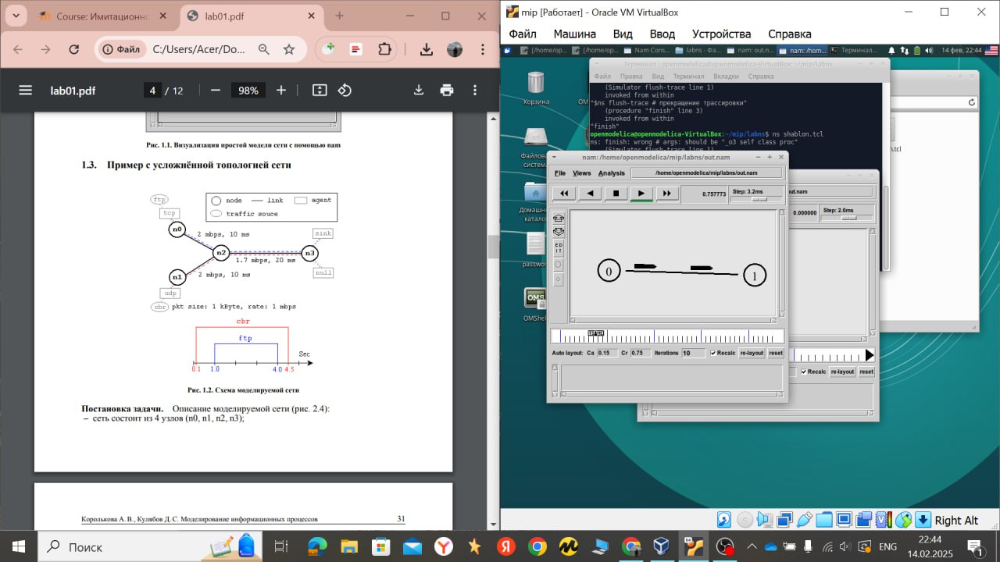
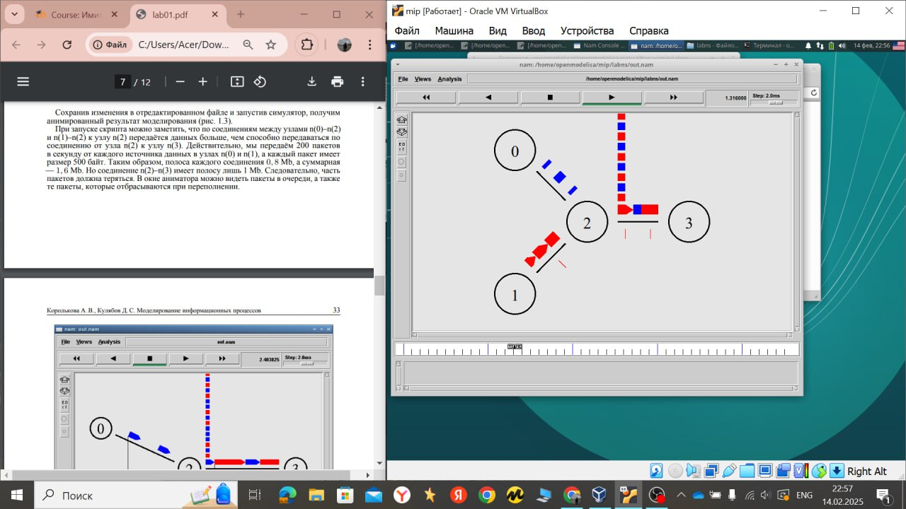
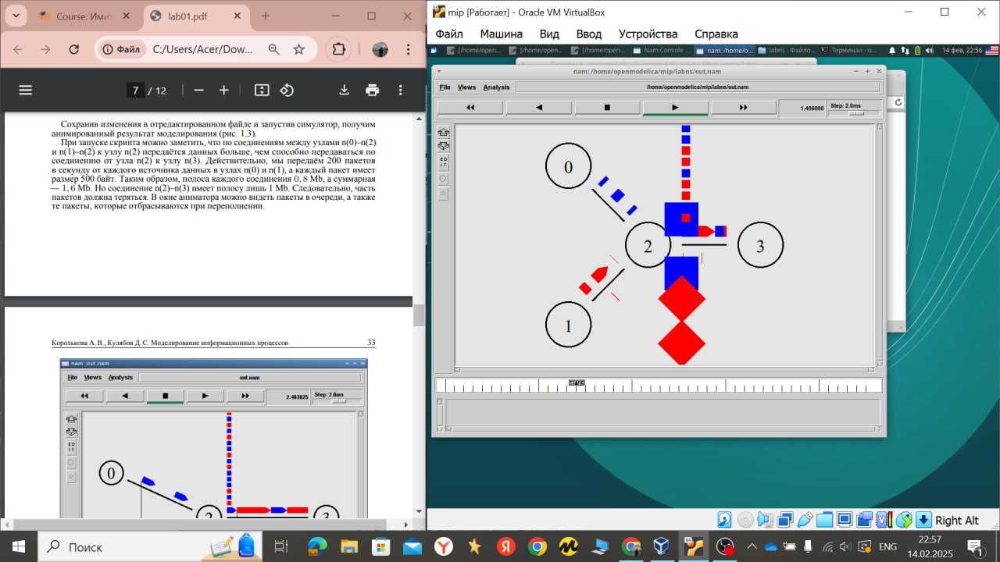
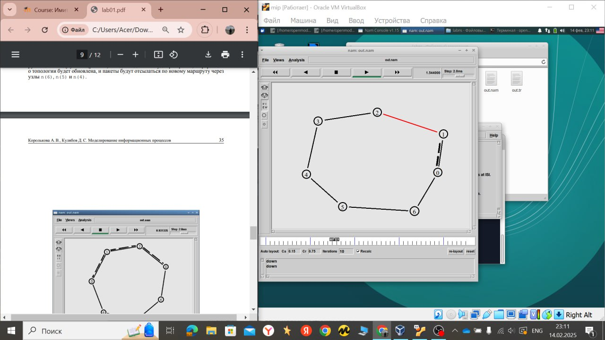
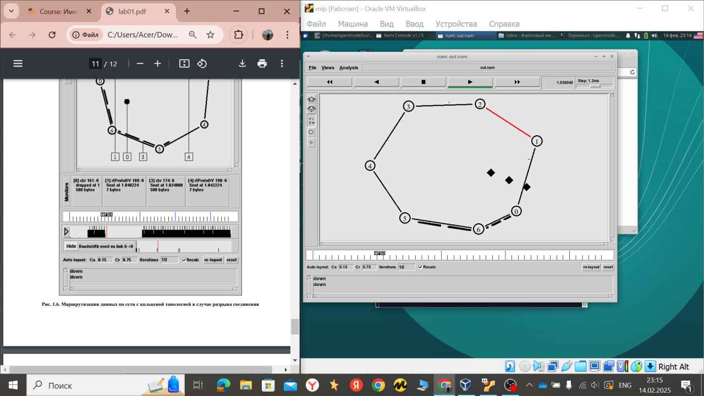
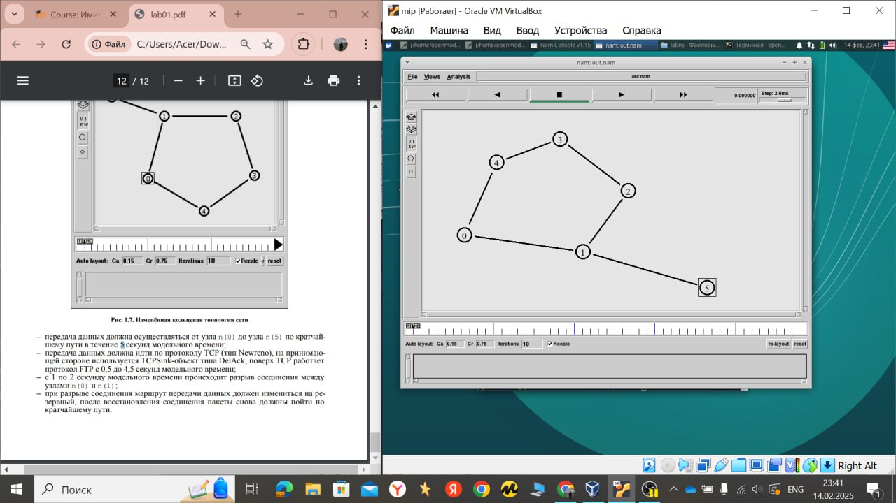
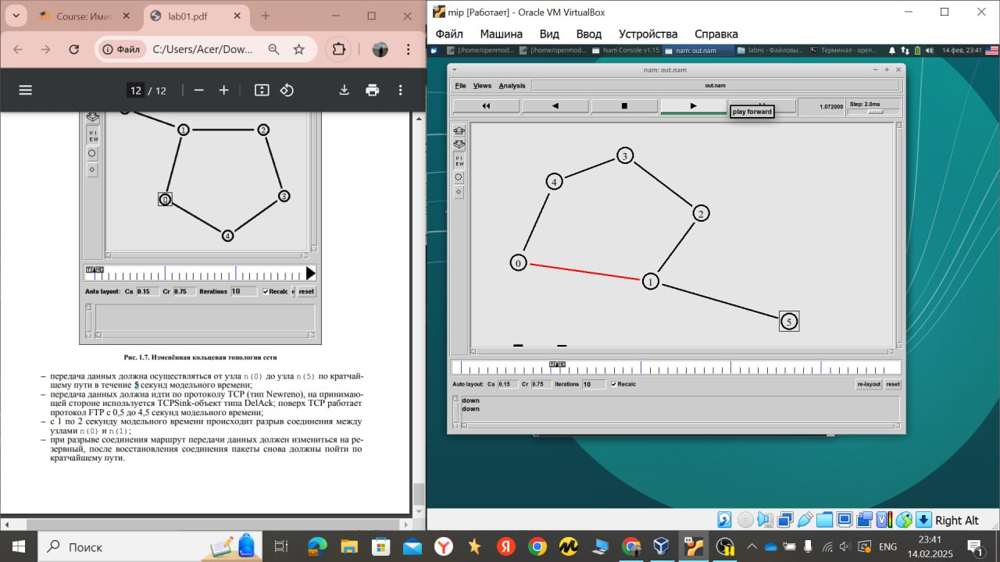

---
## Front matter
lang: ru-RU
title: "Имитационное моделирование"
subtitle: "Лабораторная работа №1. Простые модели компьютерной сети"
author:
  - Хамдамова Айжана Нфибд-01-22
institute:
  - Российский университет дружбы народов, Москва, Россия
date: 15 февраль 2025

## i18n babel
babel-lang: russian
babel-otherlangs: english

## Formatting pdf
toc: false
toc-title: Содержание
slide_level: 2
aspectratio: 169
section-titles: true
theme: metropolis
header-includes:
 - \metroset{progressbar=frametitle,sectionpage=progressbar,numbering=fraction}
 - '\makeatletter'
 - '\beamer@ignorenonframefalse'
 - '\makeatother'
---

# Информация

## Докладчик

:::::::::::::: {.columns align=center}
::: {.column width="70%"}

  * Хамдамова Айжана 
  * студент факультета Физико-математических и естественных наук
  * Российский университет дружбы народов
  * [1032225989@pfur.ru](mailto:1032225989@pfur.ru)
  * <https://github.com/AizhanaKhamdamova/study_2022-2023_os-intro>

:::
::: {.column width="30%"}

:::
::::::::::::::

# Вводная часть

## Цели и задачи

- Приобрести навыки моделирования сетей передачи данных с помощью средства имитационного моделирования NS-2
- анализ полученных результатов моделирования.

## Ход работы

## Мониторинг очереди в визуализаторе nam

## Ход работы

## Передача данных по кратчайшему пути сети с кольцевой топологией

## Передача данных по сети с кольцевой топологией в случае разрыва соединения

## Упражнение
 Маршрутизация данных по сети с кольцевой топологией в случае разрыва соединения

## Изменённая кольцевая топология сети

# Вывод
##Вывод

Приобрела навыки моделирования сетей передачи данных с помощью средства имитационного моделирования NS-2, а также анализа полученных результатов моделирования.
:::

