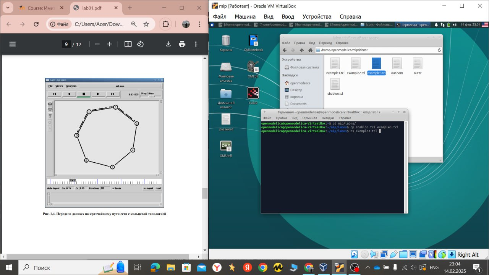

---
## Front matter
title: "Имитационное моделирование"
subtitle: "Лабораторная работа №1. Простые модели компьютерной сети"
author: "Хамдамова Айжана Нфибд-01-22"

## Generic otions
lang: ru-RU
toc-title: "Содержание"

## Bibliography
bibliography: bib/cite.bib
csl: pandoc/csl/gost-r-7-0-5-2008-numeric.csl

## Pdf output format
toc: true # Table of contents
toc-depth: 2
lof: true # List of figures
lot: true # List of tables
fontsize: 12pt
linestretch: 1.5
papersize: a4
documentclass: scrreprt
## I18n polyglossia
polyglossia-lang:
  name: russian
  options:
	- spelling=modern
	- babelshorthands=true
polyglossia-otherlangs:
  name: english
## I18n babel
babel-lang: russian
babel-otherlangs: english
## Fonts
mainfont: PT Serif
romanfont: PT Serif
sansfont: PT Sans
monofont: PT Mono
mainfontoptions: Ligatures=TeX
romanfontoptions: Ligatures=TeX
sansfontoptions: Ligatures=TeX,Scale=MatchLowercase
monofontoptions: Scale=MatchLowercase,Scale=0.9
## Biblatex
biblatex: true
biblio-style: "gost-numeric"
biblatexoptions:
  - parentracker=true
  - backend=biber
  - hyperref=auto
  - language=auto
  - autolang=other*
  - citestyle=gost-numeric
## Pandoc-crossref LaTeX customization
figureTitle: "Рис."
tableTitle: "Таблица"
listingTitle: "Листинг"
lofTitle: "Список иллюстраций"
lotTitle: "Список таблиц"
lolTitle: "Листинги"
## Misc options
indent: true
header-includes:
  - \usepackage{indentfirst}
  - \usepackage{float} # keep figures where there are in the text
  - \floatplacement{figure}{H} # keep figures where there are in the text
---

# Цель работы
Приобретение навыков моделирования сетей передачи данных с помощью средства имитационного моделирования NS-2, а также анализ полученных результатов
моделирования.

# Выполнение лабораторной работы

 1. В своём рабочем каталоге создайте директорию mip, к которой будут выполняться лабораторные работы. Внутри mip создайте директорию lab-ns, а в ней файл
shablon.tcl

2. Требуется смоделировать сеть передачи данных, состоящую
из двух узлов, соединённых дуплексной линией связи с полосой пропускания 2
Мб/с и задержкой 10 мс, очередью с обслуживанием типа DropTail. От одного узла
к другому по протоколу UDP осуществляется передача пакетов, размером 500 байт,
с постоянной скоростью 200 пакетов в секунду.

3. Создаётся агент UDP и присоединяется к узлу n0. В узле агент сам не может
генерировать трафик, он лишь реализует протоколы и алгоритмы транспортного
уровня. Поэтому к агенту присоединяется приложение. В данном случае — это
источник с постоянной скоростью (Constant Bit Rate, CBR)

4. Создадим 4 узла и 3 дуплексных соединения с указанием направления

5. Сохранив изменения в отредактированном файле и запустив симулятор, получим
анимированный результат моделирования

6. Пример с кольцевой топологией сети. Требуется построить модель передачи данных по сети с кольцевой топологией и динамической маршрутизацией пакетов

# Упражнение 
Внесите следующие изменения в реализацию примера с кольцевой
топологией сети:
– передача данных должна осуществляться от узла n(0) до узла n(5) по кратчайшему пути в течение 5 секунд модельного времени;
– передача данных должна идти по протоколу TCP (тип Newreno), на принимающей стороне используется TCPSink-объект типа DelAck; поверх TCP работает
протокол FTP с 0,5 до 4,5 секунд модельного времени;
– с 1 по 2 секунду модельного времени происходит разрыв соединения между
узлами n(0) и n(1);
– при разрыве соединения маршрут передачи данных должен измениться на резервный, после восстановления соединения пакеты снова должны пойти по
кратчайшему пути.

Приобрела навыки моделирования сетей передачи данных с помощью средства имитационного моделирования NS-2, а также анализа полученных результатов моделирования.

# Список литературы{.unnumbered}

::: {#refs}
:::
