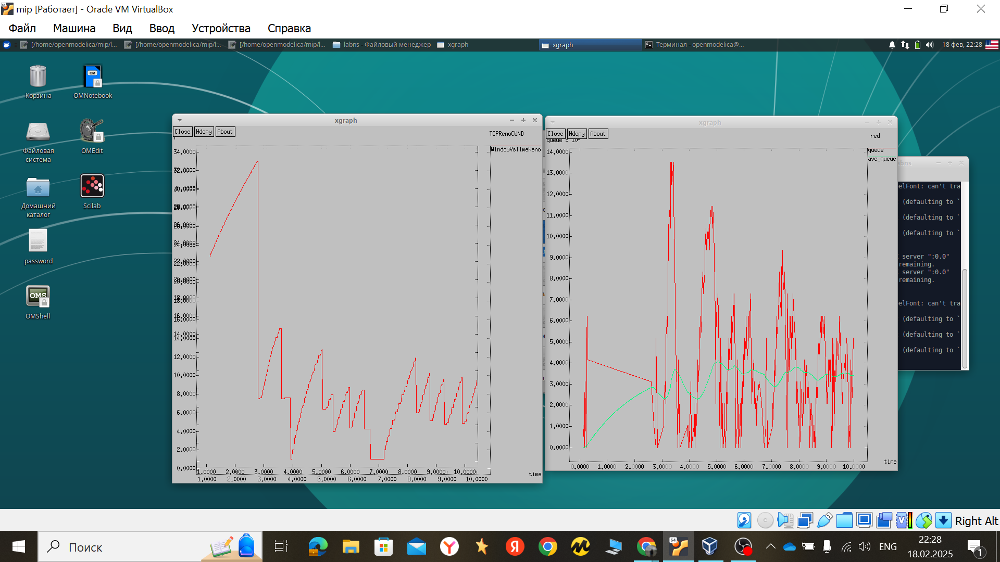
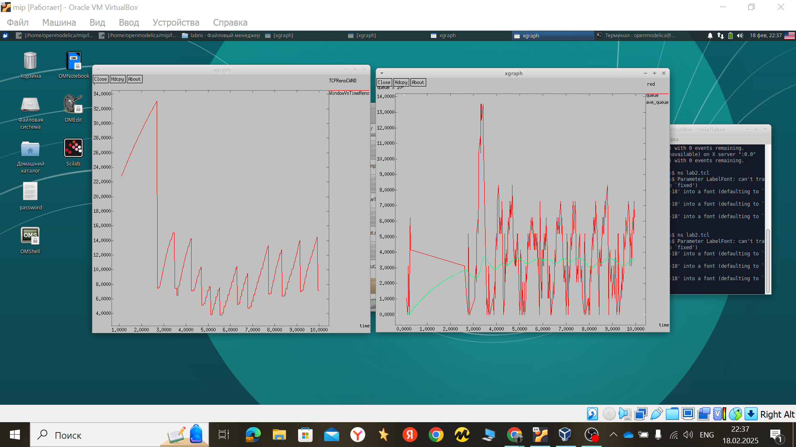
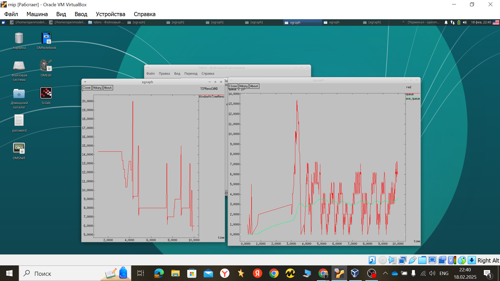
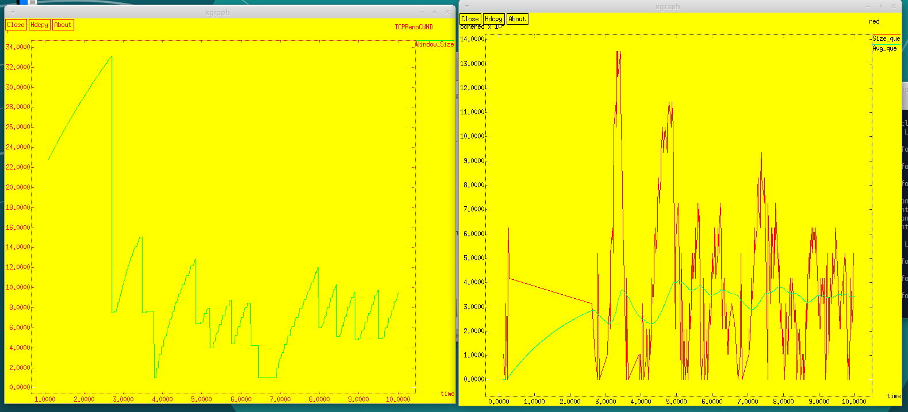

---
## Front matter
lang: ru-RU
title: Лабораторная работа 2. 
subtitle: Исследование протокола TCP и алгоритма управления очередью RED
author:
  - Хамдамова А. А. Нфибд-01-22
institute:
  - Российский университет дружбы народов, Москва, Россия
date: 19 февраля 2025

## i18n babel
babel-lang: russian
babel-otherlangs: english

## Formatting pdf
toc: false
toc-title: Содержание
slide_level: 2
aspectratio: 169
section-titles: true
theme: metropolis
header-includes:
 - \metroset{progressbar=frametitle,sectionpage=progressbar,numbering=fraction}
---

# Информация

## Докладчик

:::::::::::::: {.columns align=center}
::: {.column width="70%"}

  * Хамдамова Айжана 
  * студент факультета Физико-математических и естественных наук
  * Российский университет дружбы народов
  * [1032225989@pfur.ru](mailto:1032225989@pfur.ru)
  * <https://github.com/AizhanaKhamdamova/study_2022-2023_os-intro>

:::
::: {.column width="30%"}

:::
::::::::::::::

# Вводная часть

## Актуальность

- Исследовать протокол TCP и алгоритм управления очередью RED.

## Объект и предмет исследования

- Презентация как текст
- Программное обеспечение для создания презентаций
- Входные и выходные форматы презентаций

## Цели и задачи

1. Выполнить пример с дисциплиной RED;
2. Изменить в модели на узле s1 тип протокола TCP с Reno на NewReno, затем на Vegas. Сравнить и пояснить результаты;
3. Внести изменения при отображении окон с графиками (изменить цвет фона, цвет траекторий, подписи к осям, подпись траектории в легенде).
 
# Ход работы

## график изменения TCP-окна и длины очереди и средней длины очереди

## NewReno

## Vegas

## Ход работы

## Вывод

В процессе выполнения данной лабораторной работы я исследовала протокол TCP и алгоритм управления очередью RED.
:::

