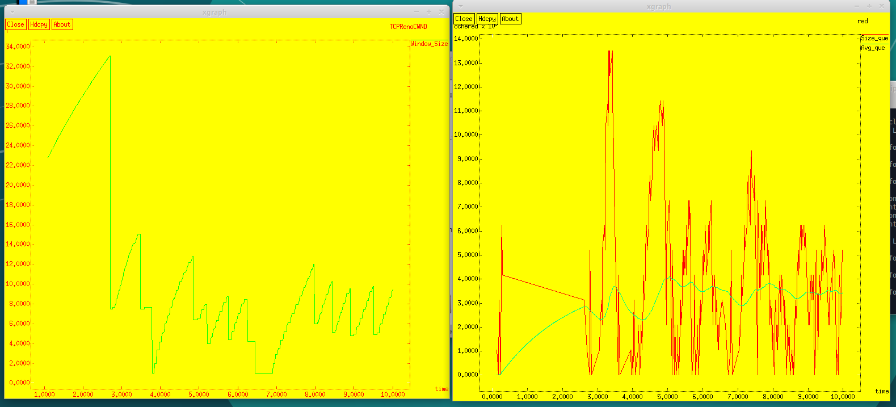

---
## Front matter
title: "Лабораторная работа 2."
subtitle: "Исследование протокола TCP и алгоритма управления очередью RED"
author: "Хамдамова Айжана"

## Generic otions
lang: ru-RU
toc-title: "Содержание"

## Bibliography
bibliography: bib/cite.bib
csl: pandoc/csl/gost-r-7-0-5-2008-numeric.csl

## Pdf output format
toc: true # Table of contents
toc-depth: 2
lof: true # List of figures
lot: true # List of tables
fontsize: 12pt
linestretch: 1.5
papersize: a4
documentclass: scrreprt
## I18n polyglossia
polyglossia-lang:
  name: russian
  options:
	- spelling=modern
	- babelshorthands=true
polyglossia-otherlangs:
  name: english
## I18n babel
babel-lang: russian
babel-otherlangs: english
## Fonts
mainfont: IBM Plex Serif
romanfont: IBM Plex Serif
sansfont: IBM Plex Sans
monofont: IBM Plex Mono
mathfont: STIX Two Math
mainfontoptions: Ligatures=Common,Ligatures=TeX,Scale=0.94
romanfontoptions: Ligatures=Common,Ligatures=TeX,Scale=0.94
sansfontoptions: Ligatures=Common,Ligatures=TeX,Scale=MatchLowercase,Scale=0.94
monofontoptions: Scale=MatchLowercase,Scale=0.94,FakeStretch=0.9
mathfontoptions:
## Biblatex
biblatex: true
biblio-style: "gost-numeric"
biblatexoptions:
  - parentracker=true
  - backend=biber
  - hyperref=auto
  - language=auto
  - autolang=other*
  - citestyle=gost-numeric
## Pandoc-crossref LaTeX customization
figureTitle: "Рис."
tableTitle: "Таблица"
listingTitle: "Листинг"
lofTitle: "Список иллюстраций"
lotTitle: "Список таблиц"
lolTitle: "Листинги"
## Misc options
indent: true
header-includes:
  - \usepackage{indentfirst}
  - \usepackage{float} # keep figures where there are in the text
  - \floatplacement{figure}{H} # keep figures where there are in the text
---

# Цель работы

Исследовать протокол TCP и алгоритм управления очередью RED.

# Задание

1. Выполнить пример с дисциплиной RED;
2. Изменить в модели на узле s1 тип протокола TCP с Reno на NewReno, затем на Vegas. Сравнить и пояснить результаты;
3. Внести изменения при отображении окон с графиками (изменить цвет фона, цвет траекторий, подписи к осям, подпись траектории в легенде).

# Теоретическое введение

Протокол управления передачей (Transmission Control Protocol, TCP) имеет средства управления потоком и коррекции ошибок, ориентирован на установление
соединения.

# Выполнение лабораторной работы

Выполним построение сети в соответствии с описанием:

* сеть состоит из 6 узлов;
* между всеми узлами установлено дуплексное соединение с различными пропускной способностью и задержкой 10 мс;
* узел r1 использует очередь с дисциплиной RED для накопления пакетов, максимальный размер которой составляет 25;
* TCP-источники на узлах s1 и s2 подключаются к TCP-приёмнику на узле s3; рис. ([-@fig:001]) 
* генераторы трафика FTP прикреплены к TCP-агентам.

Теперь разработаем сценарий, реализующий модель согласно описанию, чтобы построить в Xgraph график изменения TCP-окна, график изменения длины очереди и средней длины очереди.(рис. [-@fig:002])

{#fig:001 width=70%}

{#fig:002 width=70%}

После запуска кода получаем график изменения TCP-окна, а также график изменения длины очереди и средней длины очереди.(рис. [-@fig:003])

{#fig:003 width=70%}

По графику видно, что средняя длина очереди находится в диапазоне от 2 до 4. Максимальная длина достигает значения 14.

# Изменение протокола TCP

Сначала требуется изменить тип Reno на NewReno. Для этого изменим код:(рис. [-@fig:004])

{#fig:004 width=70%}

В результате получим следующие график изменения TCP-окна, а также график изменения длины очереди и средней длины очереди (рис. [-@fig:005]).

{#fig:005 width=70%}

Так же, как было в графике с типом Reno значение средней длины очереди находится в пределах от 2 до 4, а максимальное значение длины равно 14. Графики достаточно похожи. В обоих алгоритмах размер окна увеличивается до тех пор, пока не произойдёт потеря сегмента.

Теперь изменим тип Reno на Vegas.(рис. [-@fig:006]) Для этого изменим код:

{#fig:006 width=70%}

В результате получим следующие график изменения TCP-окна (рис. [-@fig:007]), а также график изменения длины очереди и средней длины очереди.

{#fig:007 width=70%}

По графику видно, что средняя длина очереди опять находится в диапазоне от 2 до 4 (но можно заметить, что значение длины чаще бывает меньшим, чем при типе Reno/NeReno). Максимальная длина достигает значения 14. Сильные отличия можно заметить по графикам динамики размера окна. При Vegas максимальный размер окна составляет 20, а не 34, как в NewReno. TCP Vegas обнаруживает перегрузку в сети до того, как случайно теряется пакет, и мгновенно уменьшается размер окна.Таким образом, TCP Vegas обрабатывает перегрузку без каких-либо потерь пакета.

# Изменение отображения окон с графиками
Внесем изменения при отображении окон с графиками, изменим цвет фона, цвет траекторий, подписи к осям и подпись траектории в легенде. Для этого изменим наш код:

В процедуре finish изменим цвет траекторий, подписи легенд, а также добавив опции -fg и -bg изменим цвет текста и фона в xgraph.

В разделе мониторинга размера окна TCP также изменим цвет траектории и подпись легенды.

В результате получим следующие график изменения TCP-окна (рис. [-@fig:008]), а также график изменения длины очереди и средней длины очереди.

{#fig:008 width=70%}

# Выводы

В процессе выполнения данной лабораторной работы я исследовала протокол TCP и алгоритм управления очередью RED.

# Список литературы{.unnumbered}

::: {#refs}
:::
