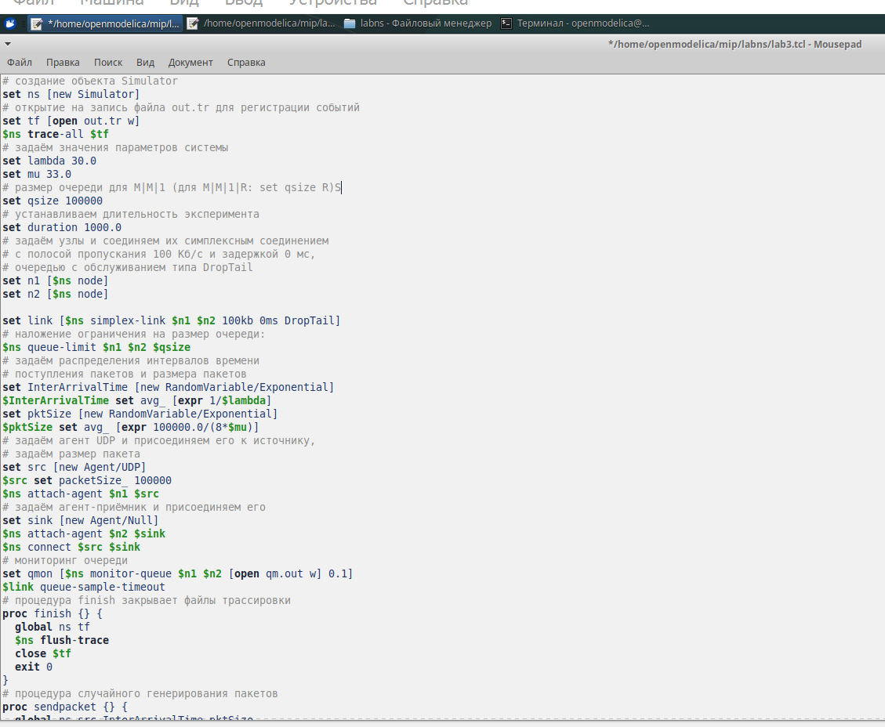
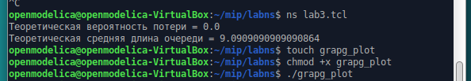
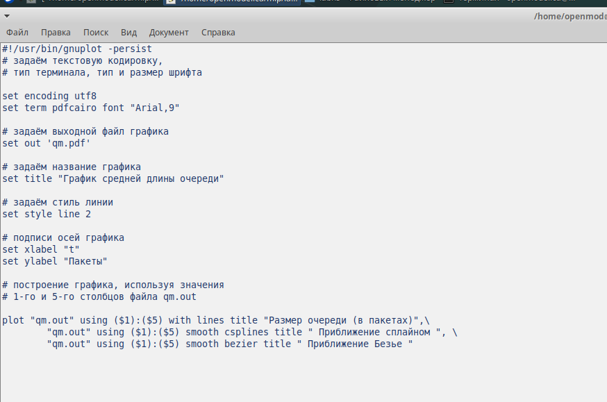
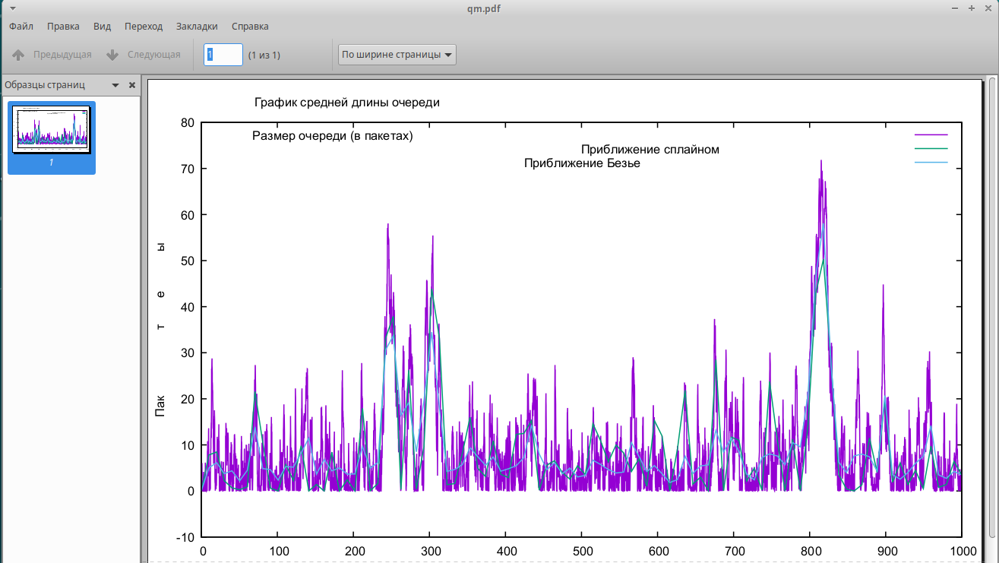

---
## Front matter
lang: ru-RU
title: Лабораторная работа 3
subtitle: Моделирование стохастических процессов
author:
  - Хамдамова Айжана
institute:
  - Российский университет дружбы народов, Москва, Россия
date: 19 февраля 2025

## i18n babel
babel-lang: russian
babel-otherlangs: english

## Formatting pdf
toc: false
toc-title: Содержание
slide_level: 2
aspectratio: 169
section-titles: true
theme: metropolis
header-includes:
 - \metroset{progressbar=frametitle,sectionpage=progressbar,numbering=fraction}
---

# Информация

## Докладчик

:::::::::::::: {.columns align=center}
::: {.column width="70%"}

  * Хамдамова Айжана 
  * студент факультета Физико-математических и естественных наук
  * Российский университет дружбы народов
  * [1032225989@pfur.ru](mailto:1032225989@pfur.ru)
  * <https://github.com/AizhanaKhamdamova/study_2022-2023_os-intro>

:::
::: {.column width="30%"}

:::
::::::::::::::

# Вводная часть
 
## Вводная часть

M|M|1 - это однолинейная СМО с накопителем бесконечной ёмкости. Поступающий поток заявок — пуассоновский с интенсивностью λ. Времена обслуживания заявок — независимые в совокупности случайные величины, распределённые по экспоненциальному закону с параметром μ.
Реализуем эту систему. Зададим параметры системы λ=30,μ=33, размер очереди 100000, длительность эксперимента 100000. Далее задаем узлы, между которыми будут идти пакеты, и соединяем их симплексным соединением с полосой пропускания 100 Кб/с и задержкой 0 мс, очередью с обслуживанием типа DropTail. Наложим ограничения на размер очереди. Источником трафика ставим UDP-агент, приемником Null-агент. Также осуществим мониторинг очереди. Процедура finish закрывает файлы трассировки. Процедура sendpack -- случайно генерирует пакеты по экспоненциальному распределению. Также в данной сценарии рассчитывается по формулам загрузка система и вероятность потери пакетов.

## Цели и задачи

- Провести моделирование системы массового обслуживания (СМО).

## Задание

1. Реализовать модель M|M|1
2. Посчитать загрузку системы и вероятность потери пакетов;
3. Построить график изменения размера очереди.

## Результаты

Запустив программу ниже, получим значения загрузки системы и вероятности потери пакетов

## значения загрузки системы и вероятности потери пакетов

## Результаты

## Результаты

На данном графике изображен размер очереди в пакетах, а также его приближение сплайном и Безье.

:::

