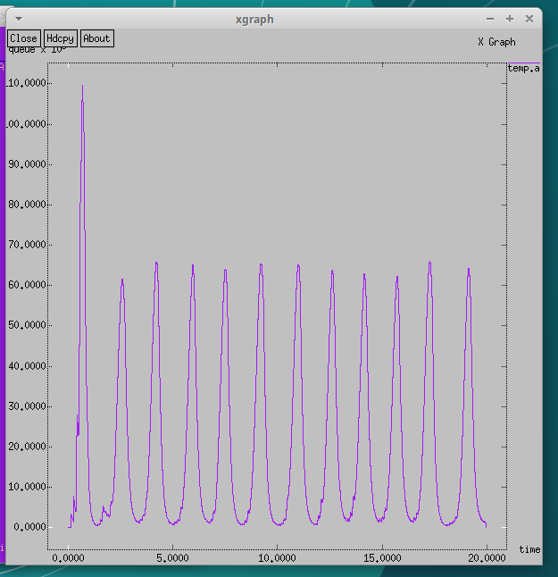

---
## Front matter
lang: ru-RU
title: Лабораторная работа 4
subtitle: Задание для самостоятельного выполнения
author:
  - Хамдамова Айжана
institute:
  - Российский университет дружбы народов, Москва, Россия
date: 27 февраля 2025

## i18n babel
babel-lang: russian
babel-otherlangs: english

## Formatting pdf
toc: false
toc-title: Содержание
slide_level: 2
aspectratio: 169
section-titles: true
theme: metropolis
header-includes:
 - \metroset{progressbar=frametitle,sectionpage=progressbar,numbering=fraction}
---

# Информация

## Докладчик

  * Хамдамова Айжана 
  * студент факультета Физико-математических и естественных наук
  * Российский университет дружбы народов
  * [1032225989@pfur.ru](mailto:1032225989@pfur.ru)
  * <https://github.com/AizhanaKhamdamova/study_2024-2025_simmod>

# Вводная часть

## Цель

Выполнить задание для самостоятельного выполнения.
Построить описанную моделируемую сеть.

## Задание

1. Для приведённой схемы разработать имитационную модель в пакете NS-2.
2. Построить график изменения размера окна TCP (в Xgraph и в GNUPlot);
3. Построить график изменения длины очереди и средней длины очереди на первом
маршрутизаторе.
4. Оформить отчёт о выполненной работе.

## График изменения размера окна TCP на линке 1-го источника с помощью xgraph

## График изменения размера окна TCP на всех источниках с помощью xgraph

## график изменения размера длины очереди с помощью xgraph

## график изменения размера средней длины очереди с помощью xgraph

## График изменения размера окна TCP на линке 1-го источника в GNUPlot

## График изменения размера окна TCP на всех источниках в GNUPlot

## График изменения размера длины очереди

## График изменения размера средней длины очереди

## Выводы
В результате выполнения данной лабораторной работы была разработана имитационная модель в пакете NS-2, построены графики изменения размера окна TCP, изменения длины очереди и средней длины очереди.
