---
## Front matter
lang: ru-RU
title: Лабораторная работа № 5
subtitle: Симулирование модели эпидемии SIR
author:
  - Хамдамова Айжана
institute:
  - Российский университет дружбы народов, Москва, Россия
date: 7 марта 2025

## i18n babel
babel-lang: russian
babel-otherlangs: english

## Formatting pdf
toc: false
toc-title: Содержание
slide_level: 2
aspectratio: 169
section-titles: true
theme: metropolis
header-includes:
 - \metroset{progressbar=frametitle,sectionpage=progressbar,numbering=fraction}
---

# Информация

## Докладчик

  * Хамдамова Айжана 
  * студент факультета Физико-математических и естественных наук
  * Российский университет дружбы народов
  * [1032225989@pfur.ru](mailto:1032225989@pfur.ru)
  * <https://github.com/AizhanaKhamdamova/study_2024-2025_simmod>

## Цель работы

Построить модель эпидемии SIR в *xcos* и OpenModelica.

## Задание

1. Реализовать модель SIR в в *xcos*;
2. Реализовать модель SIR с помощью блока Modelica в в *xcos*;
3. Реализовать модель SIR в OpenModelica;
4. Реализовать модель SIR с учётом процесса рождения / гибели особей в xcos (в том числе и с использованием блока Modelica), а также в OpenModelica;
5. Построить графики эпидемического порога при различных значениях параметров модели (в частности изменяя параметр $\mu$);
6. Сделать анализ полученных графиков в зависимости от выбранных значений параметров модели.

## Выполнение лабораторной работы

Задача о распространении эпидемии описывается системой дифференциальных уравнений:
$$
\begin{cases}
  \dot s = - \beta s(t)i(t); \\
  \dot i = \beta s(t)i(t) - \nu i(t);\\
  \dot r = \nu i(t),
\end{cases}
$$

где $\beta$ -- скорость заражения, $\nu$ -- скорость выздоровления.

## начальные данные: $\beta = 1, \, \nu = 0,3, s(0) = 0,999, \, i(0) = 0,001, \, r(0) = 0.$

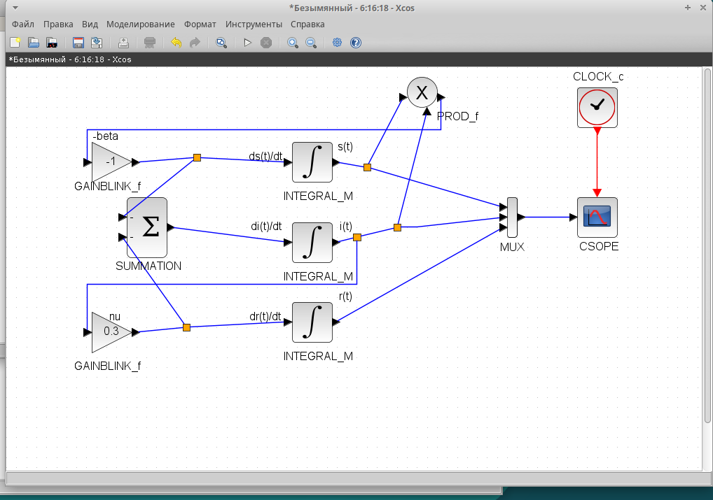

## Результат моделирования

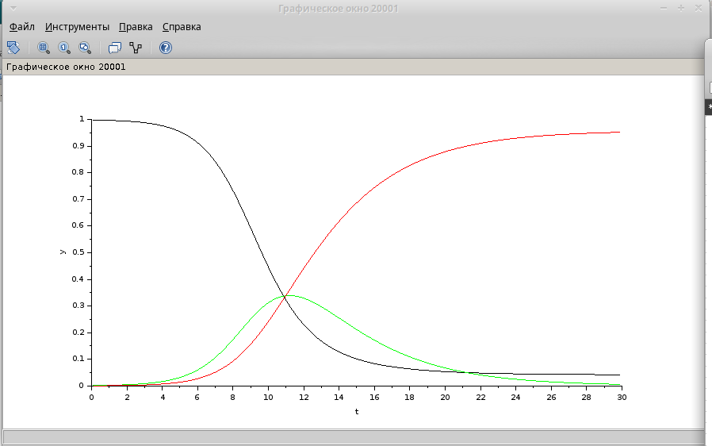

## Задание для самостоятельного выполнения

Предположим, что в модели SIR учитываются демографические процессы, в частности, что смертность
в популяции полностью уравновешивает рождаемость, а все рожденные индивидуумы появляются на свет абсолютно здоровыми. Тогда получим следующую систему уравнений:
$$
\begin{cases}
  \dot s = - \beta s(t)i(t) + \mu (N - s(t)); \\
  \dot i = \beta s(t)i(t) - \nu i(t) - \mu i(t);\\
  \dot r = \nu i(t) - \mu r(t),
\end{cases}
$$

где $\mu$ — константа, которая равна коэффициенту смертности и рождаемости.

## Модель SIR с учетом демографических процессов в xcos

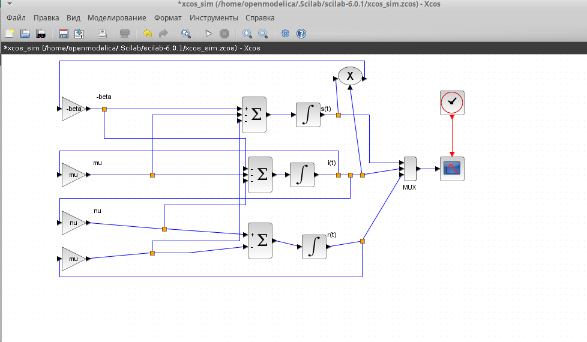

## График модели SIR с учетом демографических процессов
 
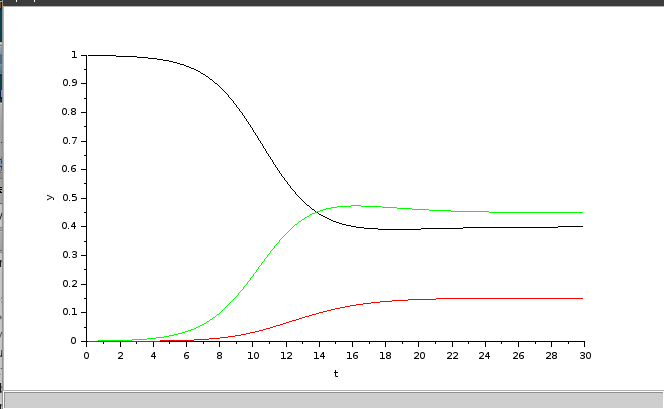

## Модель SIR с учетом демографических процессов в xcos с применением блока Modelica

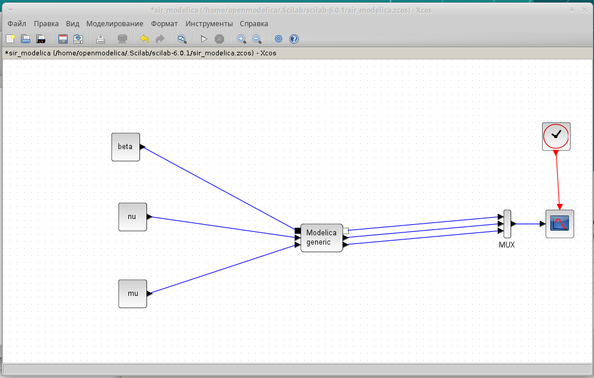

## График модели SIR

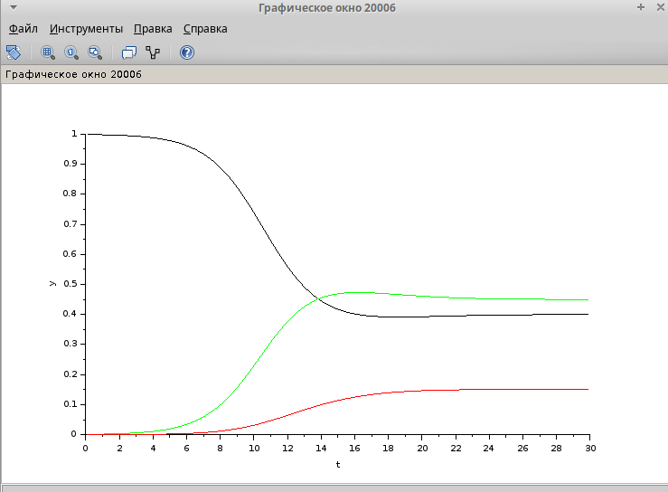

## Задание параметров в open modelica

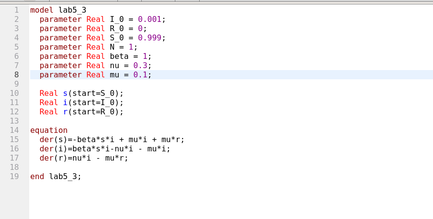

## График модели SIR с учетом демографических процессов
 
Выполнив симуляцию, получим следующий график.

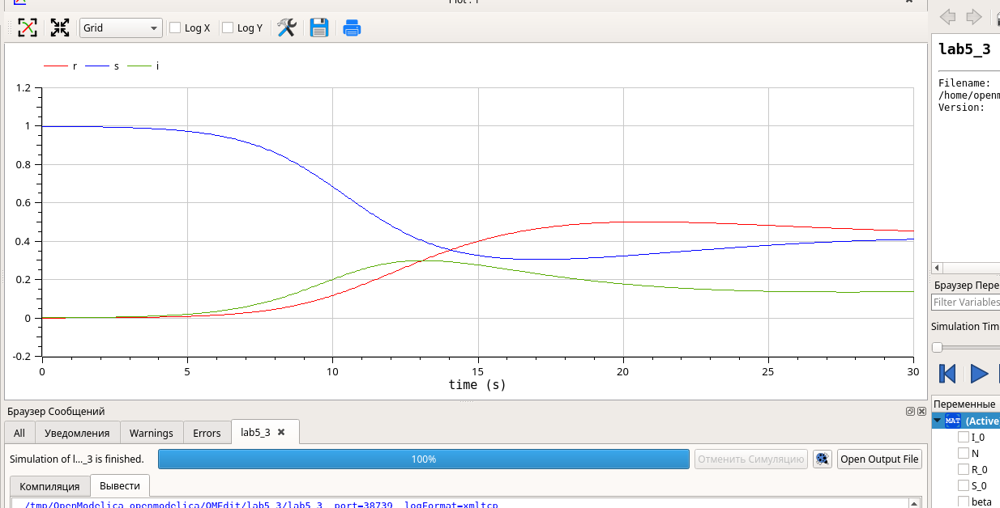

## График модели SIR  $\mu = 0.1$

Теперь построим графики при разных значениях параметров.
 $\beta = 1$, $\nu = 0.3$
 

## График модели SIR $\mu = 0.3$

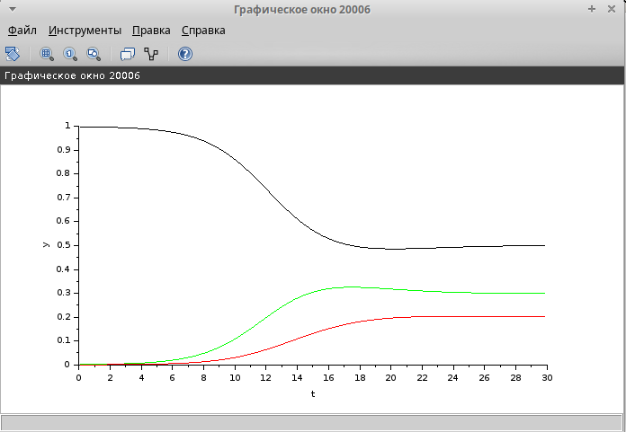

## График модели SIR $\mu = 0.5$
  
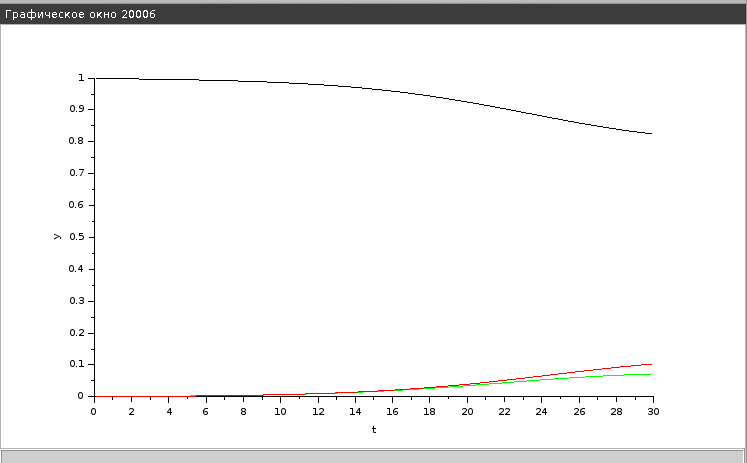

## График модели SIR $\mu = 0.9$

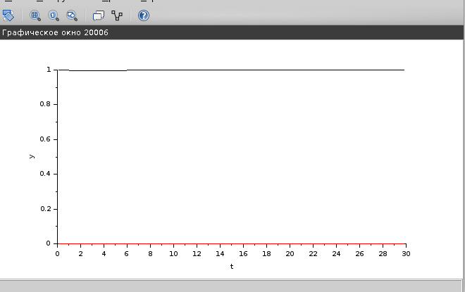

## Выводы
Исходя из анализа графиков, можно сделать вывод, что чем выше значение любого из параметров, тем быстрее система достигает стационарного
состояния. При высоком коэффициенте заражения $\beta$ система быстро проходит через пик развития эпидемии и достигает стационарного состояния.
В процессе выполнения данной лабораторной работы была построена модель SIR в *xcos* и OpenModelica.

