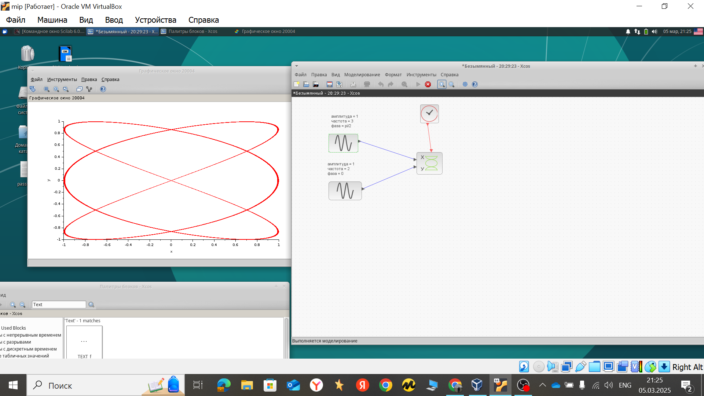

---
## Front matter
lang: ru-RU
title: Упражнение на работу с xcos
subtitle: Построение фигур Лиссажу
author:
  - Хамдамова Айжана
institute:
  - Российский университет дружбы народов, Москва, Россия
date: 5 марта 2025

## i18n babel
babel-lang: russian
babel-otherlangs: english

## Formatting pdf
toc: false
toc-title: Содержание
slide_level: 2
aspectratio: 169
section-titles: true
theme: metropolis
header-includes:
 - \metroset{progressbar=frametitle,sectionpage=progressbar,numbering=fraction}
---

# Информация

## Докладчик

  * Хамдамова Айжана 
  * студент факультета Физико-математических и естественных наук
  * Российский университет дружбы народов
  * [1032225989@pfur.ru](mailto:1032225989@pfur.ru)
  * <https://github.com/AizhanaKhamdamova/study_2024-2025_simmod>

## Цель работы

Выполнить упражнение по ознакомлению с программой **xcos**.

## Задание

Постройте с помощью xcos фигуры Лиссажу со следующими параметрами:

1) $A = B = 1, a = 2, b = 2, \, \delta = 0; \, \pi/4; \, \pi/2; \,  3\pi/4;\,  \pi;$

2) $A = B = 1, a = 2, b = 4, \, \delta = 0; \, \pi/4; \, \pi/2; \, 3\pi/4; \, \pi;$

3) $A = B = 1, a = 2, b = 6, \, \delta = 0; \, \pi/4; \, \pi/2; \, 3π/4; \, π;$

4) $A = B = 1, a = 2, b = 3, \, \delta = 0; \, \pi/4; \, \pi/2; \, 3\pi/4; \, \pi.$

## Фигура Лиссажу

Математическое выражение для кривой Лиссажу:
$$\begin{cases}
  x(t) = A sin(at + \delta),\\
  y(t) = B sin(bt),
\end{cases}$$
где $A, B$ -- амплитуды колебаний, $a, b$ -- частоты, $\delta$ -- сдвиг фаз.

## Блоки в xcos

- CLOCK_c -- запуск часов модельного времени;
- GENSIN_f -- блок генератора синусоидального сигнала;
- CSOPXY -- анимированное регистрирующее устройство для построения графика
типа y = f(x);
- TEXT_f -- задаёт текст примечаний.

## Ход работы

## Ход работы

## Ход работы

## Ход работы

## Ход работы

##Ход работы 

 

## Выводы

В результате выполнения данной лабораторной работы я выполнила упражнение по ознакомлению с программой *xcos*.

