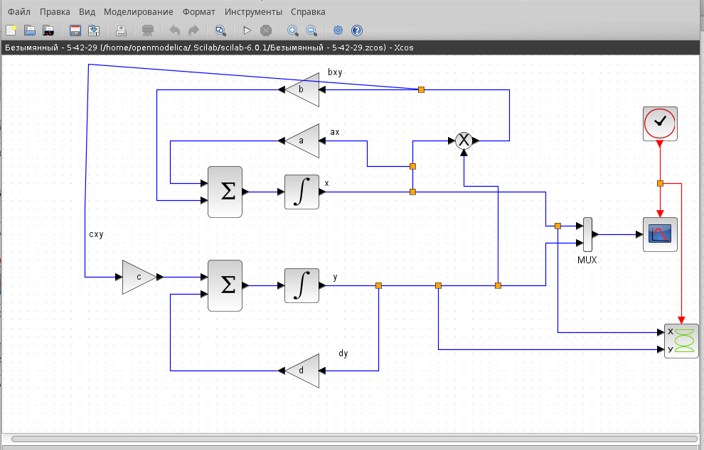
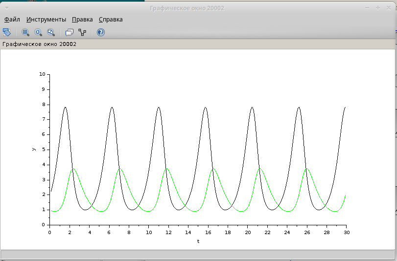
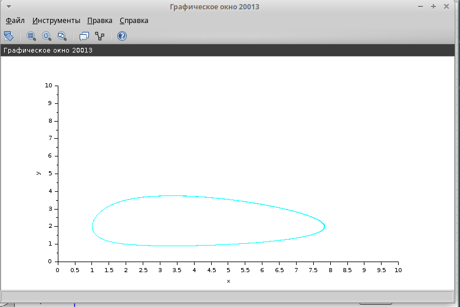
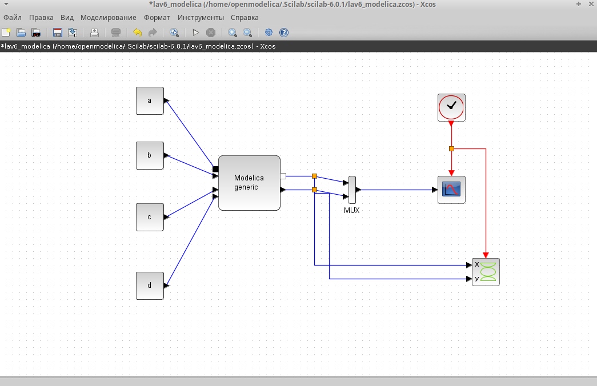
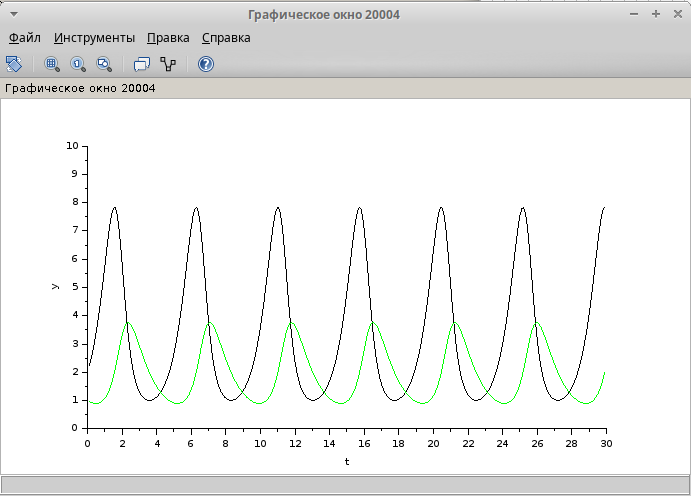
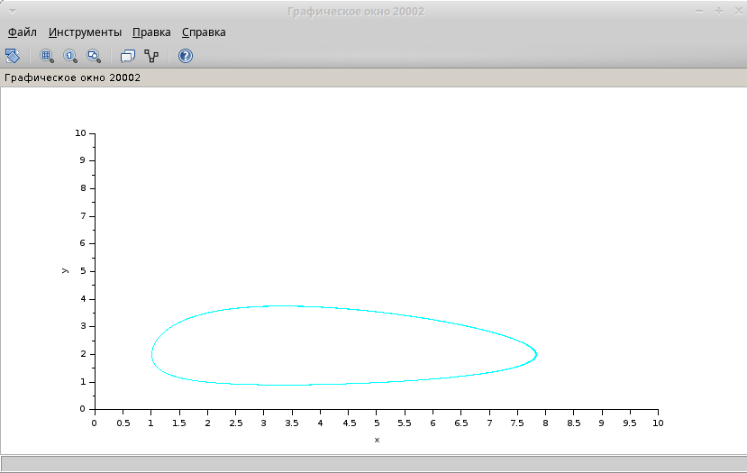
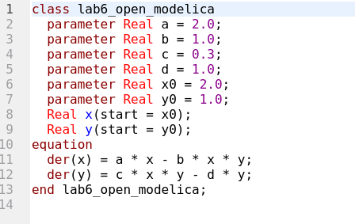
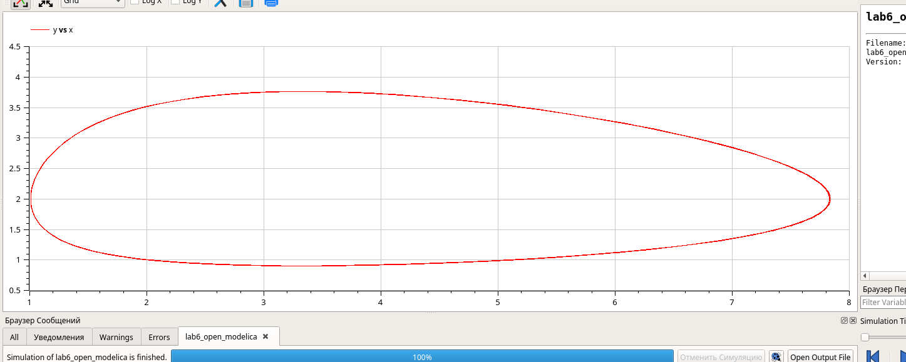
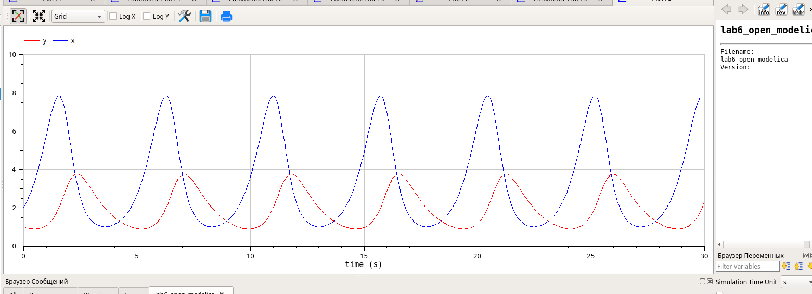

---
## Front matter
lang: ru-RU
title: Лабораторная работа 6
subtitle: Модель «хищник–жертва»
author:
  - Хамдамова Айжана
institute:
  - Российский университет дружбы народов, Москва, Россия
date: 14 марта 2025

## i18n babel
babel-lang: russian
babel-otherlangs: english

## Formatting pdf
toc: false
toc-title: Содержание
slide_level: 2
aspectratio: 169
section-titles: true
theme: metropolis
header-includes:
 - \metroset{progressbar=frametitle,sectionpage=progressbar,numbering=fraction}
---

# Информация

## Докладчик

  * Хамдамова Айжана 
  * студент факультета Физико-математических и естественных наук
  * Российский университет дружбы народов
  * [1032225989@pfur.ru](mailto:1032225989@pfur.ru)
  * <https://github.com/AizhanaKhamdamova/study_2024-2025_simmod>
  

# Вводная часть

## Теоретическое введение

 Модель «хищник–жертва» (модель Лотки — Вольтерры) представляет собой модель
межвидовой конкуренции. В математической
форме модель имеет вид:

$$
\begin{cases}
  \dot x = ax - bxy \\
  \dot y = cxy - dy,
\end{cases}
$$

где $x$ — количество жертв; $y$ — количество хищников; $a, b, c, d$ — коэффициенты, отражающие взаимодействия между видами: $a$ — коэффициент рождаемости
жертв; $b$ — коэффициент убыли жертв; $c$ — коэффициент рождения хищников; $d$ —
коэффициент убыли хищников.

## Цели и задачи

- Реализовать модель "хищник-жертва" в xcos;
- Реализовать модель "хищник-жертва" с помощью блока Modelica в xcos;
- Реализовать модель "хищник-жертва" в OpenModelica

# Реализация модели в xcos

## Модель «хищник–жертва» в xcos

## График изменения численности хищников и жертв  
$a = 2, b = 1, c = 0.3, d = 1, x(0) = 2, y(0) = 1$

## Фазовый портрет модели Лотки-Вольтерры 

# Реализация модели с помощью блока Modelica в xcos

## Модель «хищник–жертва» в xcos с применением блока Modelica

## График изменения численности хищников и жертв при $a = 2, b = 1, c = 0.3, d = 1, x(0) = 2, y(0) = 1$

## Фазовый портрет модели Лотки-Вольтерры при $a = 2, b = 1, c = 0.3, d = 1, x(0) = 2, y(0) = 1$

## Упражнение
Код в Open Modelica

## график изменения численности хищников и жертв при $a = 2, b = 1, c = 0.3, d = 1, x(0) = 2, y(0) = 1$

## Фазовый портрет модели Лотки-Вольтерры при $a = 2, b = 1, c = 0.3, d = 1, x(0) = 2, y(0) = 1$

## Выводы

В процессе выполнения данной лабораторной я научилась реализовывать модель "хищник-жертва" в *xcos*.

