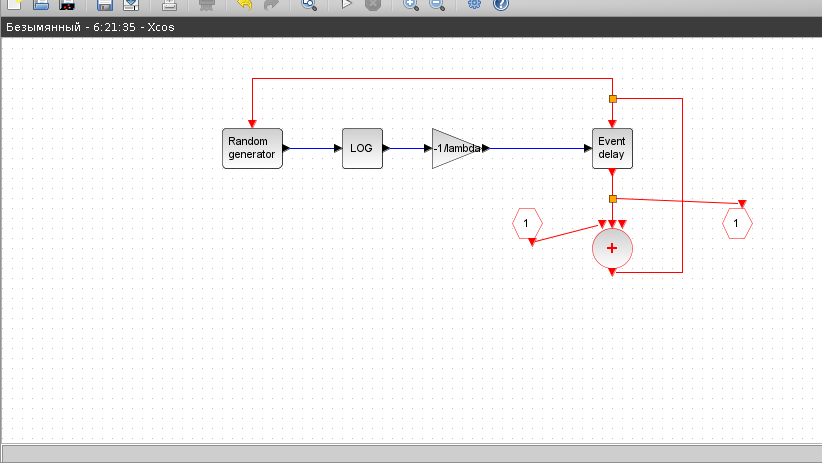
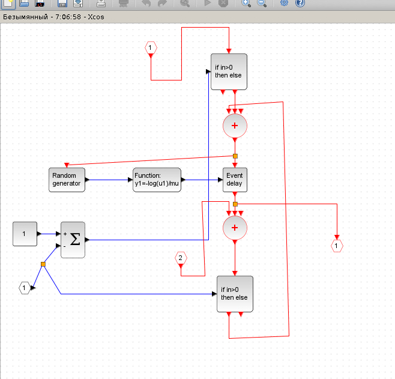
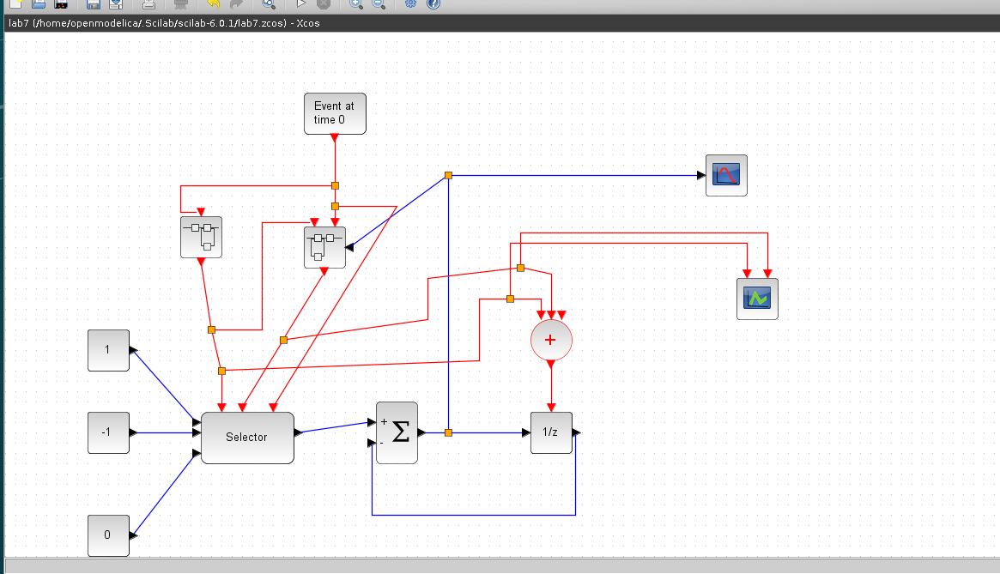
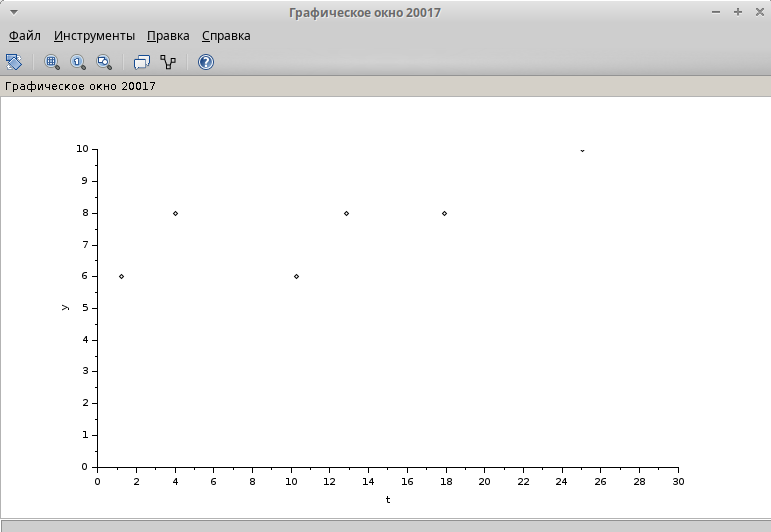
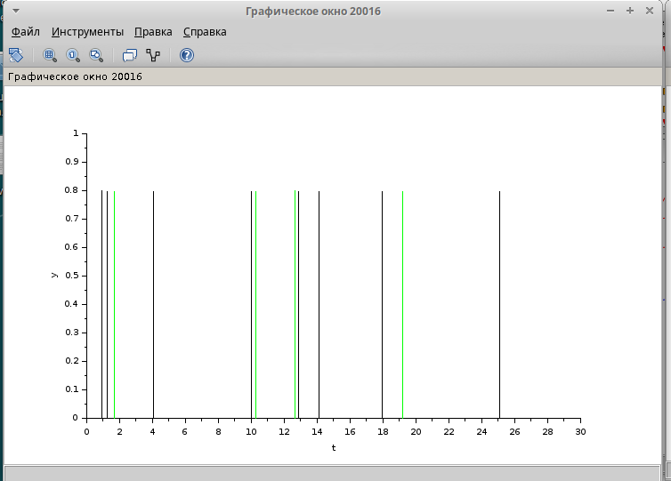

---
## Front matter
lang: ru-RU
title: Лабораторная работа № 7
subtitle: Модель M|M|1|
author:
  - Хамдамова Айжана
institute:
  - Российский университет дружбы народов, Москва, Россия
date: 16 марта 2025

## i18n babel
babel-lang: russian
babel-otherlangs: english

## Formatting pdf
toc: false
toc-title: Содержание
slide_level: 2
aspectratio: 169
section-titles: true
theme: metropolis
header-includes:
 - \metroset{progressbar=frametitle,sectionpage=progressbar,numbering=fraction}
---

# Информация

## Докладчик

  * Хамдамова Айжана 
  * студент факультета Физико-математических и естественных наук
  * Российский университет дружбы народов
  * [1032225989@pfur.ru](mailto:1032225989@pfur.ru)
  * <https://github.com/AizhanaKhamdamova/study_2024-2025_simmod>
  

## Цели и задачи

- Реализовать модель системы массового обслуживания типа $M|M|1|\infty$;
- Построить график поступления и обработки заявок;
- Построить график динамики размера очереди.

## Ход работы

начальные данные: $\lambda = 0.3, \, \mu = 0.35, \, z_0 = 6$

## Суперблок, моделирующий поступление заявок 

## Суперблок, моделирующий обработку заявок

## Модель $M|M|1|\infty$ в xcos

## График динамики размера очереди
 

## График поступлении и обработки заявок

## Выводы 

В процессе выполнения данной лабораторной работы я смогла реализовать модель системы массового обслуживания типа $M|M|1|\infty$ в xcos. 
