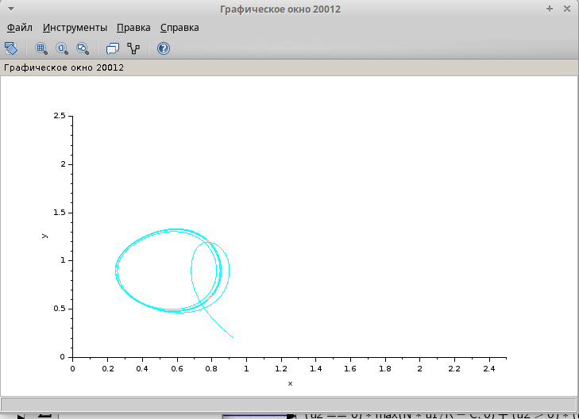

---
## Front matter
lang: ru-RU
title: Лабораторная работа № 8 
subtitle: Модель TCP/AQM
author:
  - Хамдамова Айжана
institute:
  - Российский университет дружбы народов, Москва, Россия
date: 29 марта 2025

## i18n babel
babel-lang: russian
babel-otherlangs: english

## Formatting pdf
toc: false
toc-title: Содержание
slide_level: 2
aspectratio: 169
section-titles: true
theme: metropolis
header-includes:
 - \metroset{progressbar=frametitle,sectionpage=progressbar,numbering=fraction}
---

# Информация

## Докладчик

:::::::::::::: {.columns align=center}
::: {.column width="70%"}

  * Хамдамова Айжана 
  * студент факультета Физико-математических и естественных наук
  * Российский университет дружбы народов
  * [1032225989@pfur.ru](mailto:1032225989@pfur.ru)
  * <https://github.com/AizhanaKhamdamova/study_2024-2025_simmod>

:::
::: {.column width="30%"}

:::
::::::::::::::

## Цели и задачи

- Построить модель TCP/AQM в xcos;
- Построить графики динамики изменения размера TCP окна $W(t)$ и размера очереди $Q(t)$;
- Построить модель TCP/AQM в OpenModelica;

## Выполнение лабораторной работы

## Ход работы в xsoc

{#fig:002 width=70%}

## Ход работы в xsoc

## Ход работы в xsoc

{#fig:004 width=70%}

## Ход работы в xsoc

## Ход работы в xsoc

## Реализация модели в OpenModelica

## Реализация модели в OpenModelica

## Выводы

В процессе выполнения данной лабораторной работы я реализовала модель TCP/AQM в xcos и OpenModelica.

## Список литературы{.unnumbered}

Братусь А. С., Новожилов Артем Сергеевич abd Платонов А. П. Динамические системы и модели биологии. — М. : ФИЗМАТЛИТ, 2010. — 400 с.

OM overall User’s Guide. — 2020. — URL: https://www.openmodelica.org/useresresources/userdocumentation.

Modelica Language. — URL: https : / / www . modelica . org /
modelicalanguage.

OpenModelica. — URL: https://www.openmodelica.org/.

Xcos. — URL: https://www.scilab.org/software/xcos.
