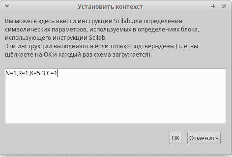
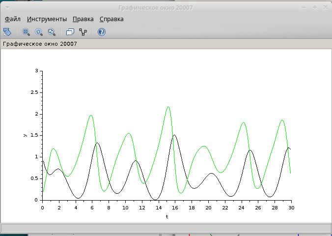
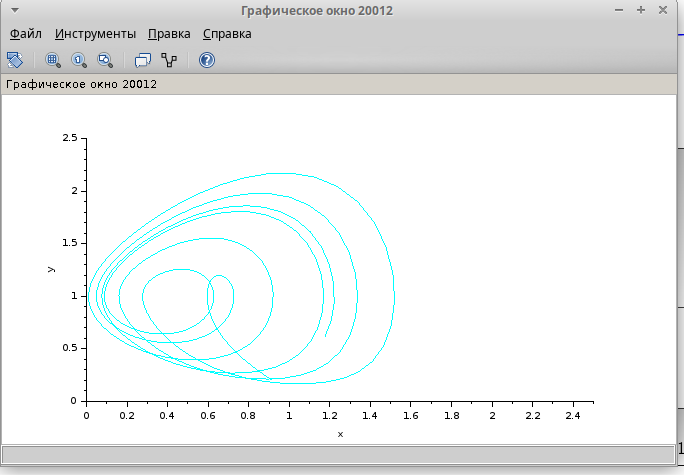
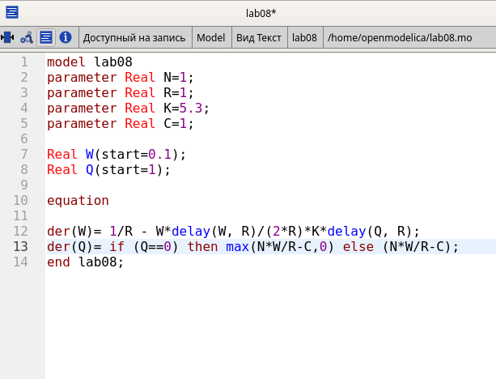
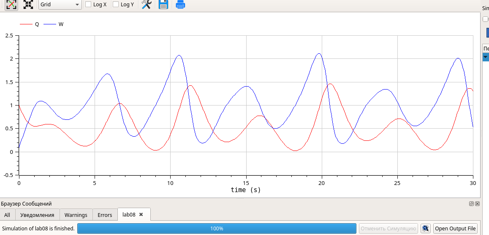

---
## Front matter
title: "Лбораторная работа № 8 "
subtitle: "Модель TCP/AQM"
author: "Хамдамова Айжана"

## Generic otions
lang: ru-RU
toc-title: "Содержание"

## Bibliography
bibliography: bib/cite.bib
csl: pandoc/csl/gost-r-7-0-5-2008-numeric.csl

## Pdf output format
toc: true # Table of contents
toc-depth: 2
lof: true # List of figures
lot: true # List of tables
fontsize: 12pt
linestretch: 1.5
papersize: a4
documentclass: scrreprt
## I18n polyglossia
polyglossia-lang:
  name: russian
  options:
	- spelling=modern
	- babelshorthands=true
polyglossia-otherlangs:
  name: english
## I18n babel
babel-lang: russian
babel-otherlangs: english
## Fonts
mainfont: IBM Plex Serif
romanfont: IBM Plex Serif
sansfont: IBM Plex Sans
monofont: IBM Plex Mono
mathfont: STIX Two Math
mainfontoptions: Ligatures=Common,Ligatures=TeX,Scale=0.94
romanfontoptions: Ligatures=Common,Ligatures=TeX,Scale=0.94
sansfontoptions: Ligatures=Common,Ligatures=TeX,Scale=MatchLowercase,Scale=0.94
monofontoptions: Scale=MatchLowercase,Scale=0.94,FakeStretch=0.9
mathfontoptions:
## Biblatex
biblatex: true
biblio-style: "gost-numeric"
biblatexoptions:
  - parentracker=true
  - backend=biber
  - hyperref=auto
  - language=auto
  - autolang=other*
  - citestyle=gost-numeric
## Pandoc-crossref LaTeX customization
figureTitle: "Рис."
tableTitle: "Таблица"
listingTitle: "Листинг"
lofTitle: "Список иллюстраций"
lotTitle: "Список таблиц"
lolTitle: "Листинги"
## Misc options
indent: true
header-includes:
  - \usepackage{indentfirst}
  - \usepackage{float} # keep figures where there are in the text
  - \floatplacement{figure}{H} # keep figures where there are in the text
---

# Цель работы

Реализовать модель TCP/AQM в xcos и OpenModelica.

# Задание

1. Построить модель TCP/AQM в xcos;
2. Построить графики динамики изменения размера TCP окна $W(t)$ и размера очереди $Q(t)$;
3. Построить модель TCP/AQM в OpenModelica;

# Выполнение лабораторной работы

## Реализация в xcos

Построим схему xcos, моделирующую нашу систему, с начальными значениями параметров $N = 1, R = 1, K = 5.3, C = 1, W(0) = 0.1, Q(0) = 1$.
Для этого сначала зададим переменные окружения (рис. [-@fig:001]).

{#fig:001 width=70%}

Затем реализуем модель TCP/AQM, разместив блоки интегрирования, суммирования, произведения, констант, а также регистрирующие устройства (рис. [-@fig:002]):

{#fig:002 width=70%}

В результате получим динамику изменения размера TCP окна W(t) (зеленая линия) и размера очереди Q(t) (черная линия), а также фазовый портрет, который показывает наличие автоколебаний параметров системы — фазовая траектория осциллирует вокруг своей стационарной точки (рис. [-@fig:003], [-@fig:004]):

{#fig:003 width=70%}

{#fig:004 width=70%}

Уменьшив скорость обработки пакетов $C$ до $0.9$ увидим, что автоколебания стали более выраженными (рис. [-@fig:005], [-@fig:006]).

{#fig:005 width=70%}

{#fig:006 width=70%}

## Реализация модели в OpenModelica

Перейдем к реализации модели в OpenModelica. Зададим параметры, начальные значения и систему уравнений.(рис. [-@fig:009])

{#fig:009 width=70%}

Выполнив симуляцию, получим динамику изменения размера TCP окна W(t)(зеленая линия) и размера очереди Q(t)(черная линия), а также фазовый портрет, который показывает наличие автоколебаний параметров системы — фазовая траектория осциллирует вокруг своей стационарной точки (рис. [-@fig:007], [-@fig:008]).

{#fig:007 width=70%}

{#fig:008 width=70%}

# Выводы

В процессе выполнения данной лабораторной работы я реализовала модель TCP/AQM в xcos и OpenModelica.

# Список литературы{.unnumbered}

Братусь А. С., Новожилов Артем Сергеевич abd Платонов А. П. Динамические системы и модели биологии. — М. : ФИЗМАТЛИТ, 2010. — 400 с.

OM overall User’s Guide. — 2020. — URL: https://www.openmodelica.org/useresresources/userdocumentation.

Modelica Language. — URL: https : / / www . modelica . org /
modelicalanguage.

OpenModelica. — URL: https://www.openmodelica.org/.

Xcos. — URL: https://www.scilab.org/software/xcos.

