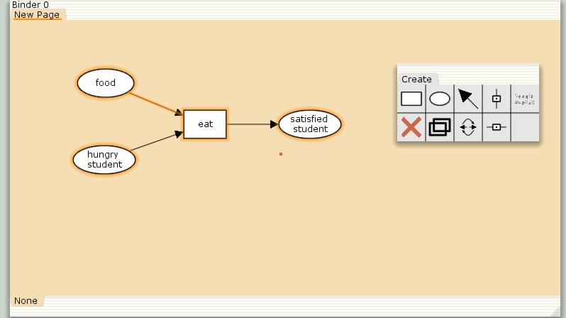
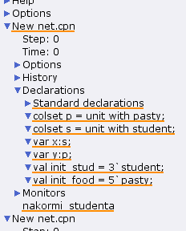
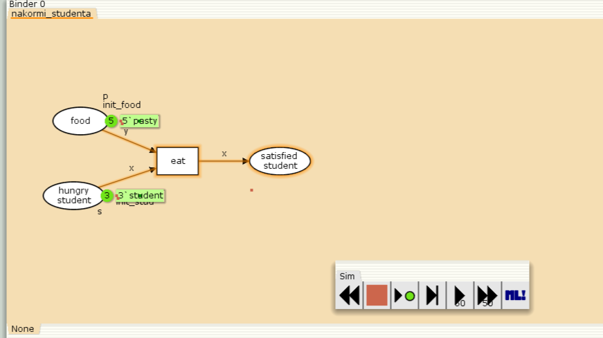
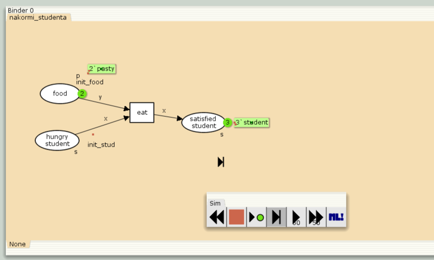
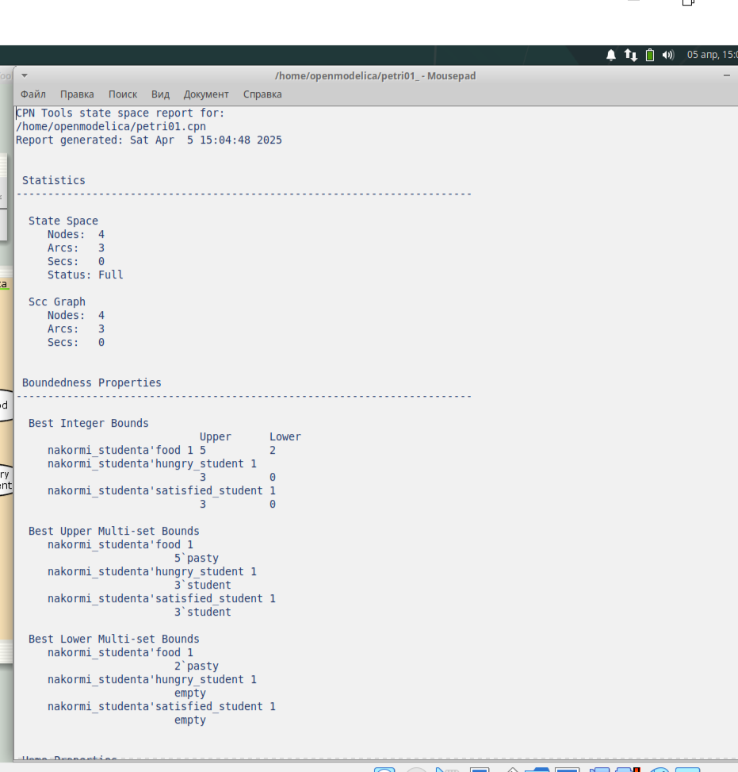
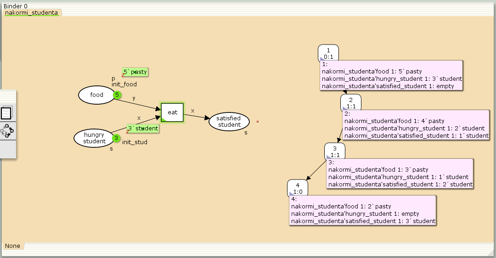

---
## Front matter
lang: ru-RU
title: Лабораторная работа 9
subtitle:  Модель «Накорми студентов»
author:
  - Хамдамова Айжана
institute:
  - Российский университет дружбы народов, Москва, Россия
date: 5 апреля 2025

## i18n babel
babel-lang: russian
babel-otherlangs: english

## Formatting pdf
toc: false
toc-title: Содержание
slide_level: 2
aspectratio: 169
section-titles: true
theme: metropolis
header-includes:
 - \metroset{progressbar=frametitle,sectionpage=progressbar,numbering=fraction}
---

# Информация

## Докладчик

:::::::::::::: {.columns align=center}
::: {.column width="70%"}

  * Хамдамова Айжана 
  * студент факультета Физико-математических и естественных наук
  * Российский университет дружбы народов
  * [1032225989@pfur.ru](mailto:1032225989@pfur.ru)
  * <https://github.com/AizhanaKhamdamova/study_2024-2025_simmod>

:::
::: {.column width="30%"}

:::
::::::::::::::

## Цели и задачи

- Реализовать модель "Накорми студентов" в CPN Tools;

- Вычислить пространство состояний, сформировать отчет о нем и построить граф.

## Ход работы 

Рассмотрим пример студентов, обедающих пирогами. Голодный студент становится сытым после того, как съедает пирог.

Мы имеем:
- два типа фишек: «пироги» и «студенты»;
- три позиции: «голодный студент», «пирожки», «сытый студент»;
- один переход: «съесть пирожок».

## Ход работы 

{#fig:001 width=70%}

## Ход работы 

{#fig:002 width=70%}

## Ход работы

{#fig:003 width=70%}

## Ход работы

{#fig:004 width=70%}

## Ход работы

{#fig:006 width=70%}

## Ход работы

{#fig:005 width=70%}

## Выводы

В процессе выполнения данной лабораторной работы я реализовала модель "Накорми студентов" в CPN Tools.
