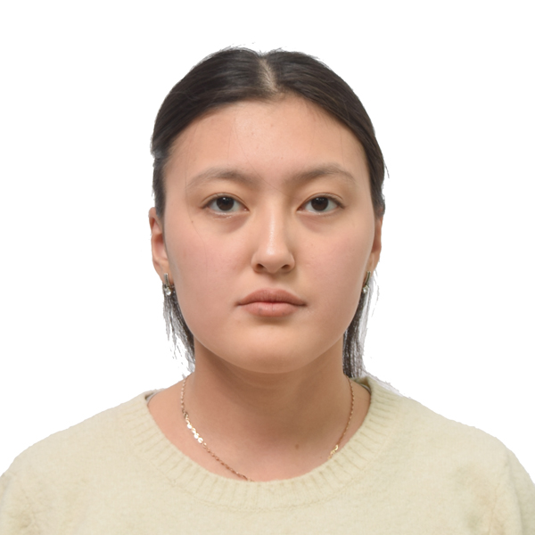
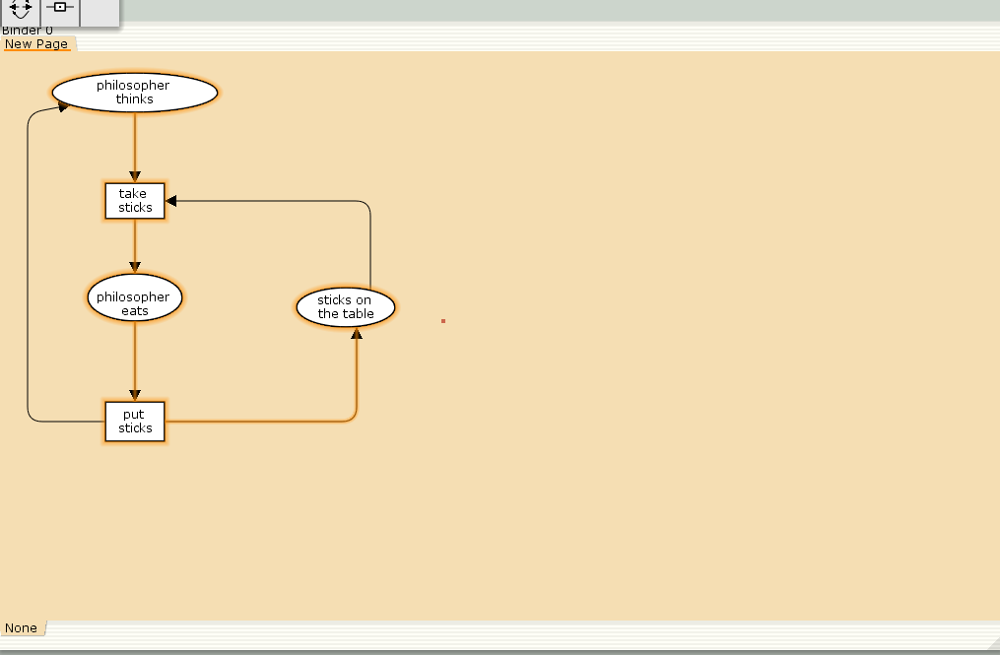
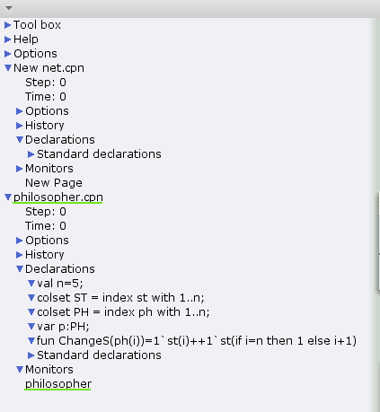
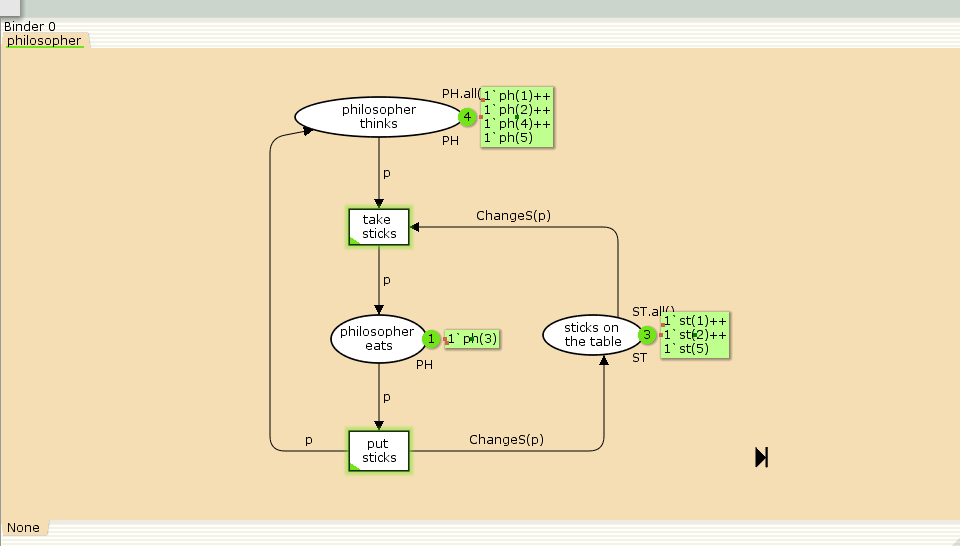
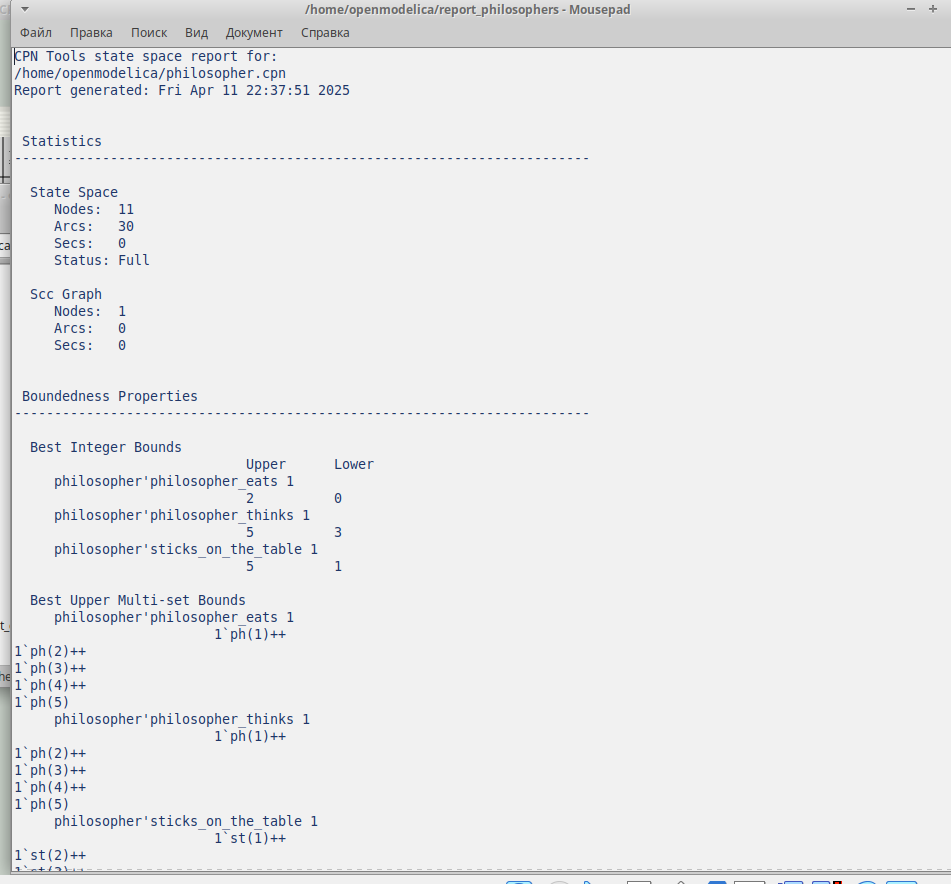
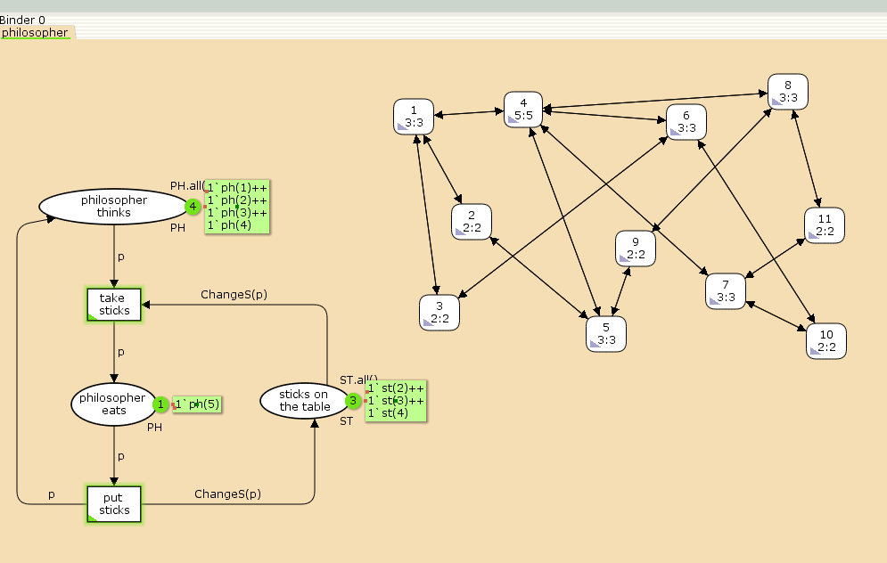
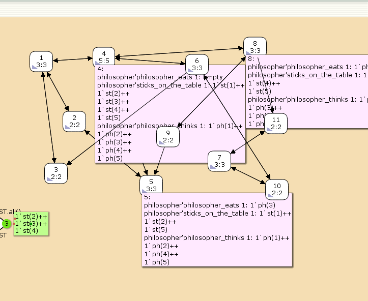

---
## Front matter
lang: ru-RU
title: Лабораторная работа № 10
subtitle: Задача об обедающих мудрецах
author:
  - Хамдамова Айжана
institute:
  - Российский университет дружбы народов, Москва, Россия
date: 11 апреля 2025

## i18n babel
babel-lang: russian
babel-otherlangs: english

## Formatting pdf
toc: false
toc-title: Содержание
slide_level: 2
aspectratio: 169
section-titles: true
theme: metropolis
header-includes:
 - \metroset{progressbar=frametitle,sectionpage=progressbar,numbering=fraction}
---

# Информация

## Докладчик

:::::::::::::: {.columns align=center}
::: {.column width="70%"}

  * Хамдамова Айжана 
  * студент факультета Физико-математических и естественных наук
  * Российский университет дружбы народов
  * [1032225989@pfur.ru](mailto:1032225989@pfur.ru)
  * <https://github.com/AizhanaKhamdamova/study_2024-2025_simmod>

:::
::: {.column width="30%"}

:::
::::::::::::::

## Цели и задачи

- Реализовать модель задачи об обедающих мудрецах  в CPN Tools;
- Вычислить пространство состояний, сформировать отчет о нем и построить граф.

## **Постановка задачи**

Пять мудрецов сидят за круглым столом и могут пребывать в двух состояниях --
думать и есть. Между соседями лежит одна палочка для еды. Для приёма пищи
необходимы две палочки. Палочки -- пересекающийся ресурс. Необходимо синхронизировать процесс еды так, чтобы мудрецы не умерли с голода. 
Рисуем граф сети. Для этого с помощью контекстного меню создаём новую сеть,
добавляем позиции, переходы и дуги.
Начальные данные:
- позиции: мудрец размышляет (philosopher thinks), мудрец ест (philosopher eats),
палочки находятся на столе (sticks on the table)
- переходы: взять палочки (take sticks), положить палочки (put sticks)

## Ход работы 

## Ход работы 

## Ход работы 

## Выполнение упражнения 

## Построим граф пространства состояний

## Выполнение упражнения

## Выводы

В процессе выполнения данной лабораторной работы я реализовала модель задачи об обедающих мудрецах в CPN Tools.

## Список литературы{.unnumbered}

1. Зайцев Д. А., Шмелева Т. Р. Моделирование телекоммуникационных систем
в CPN Tools. — Одесса : Одесская национальная академия связи им. А.С. Попова,
2008.
2. CPN Tool. — 2014. — URL: http://cpntools.org.
