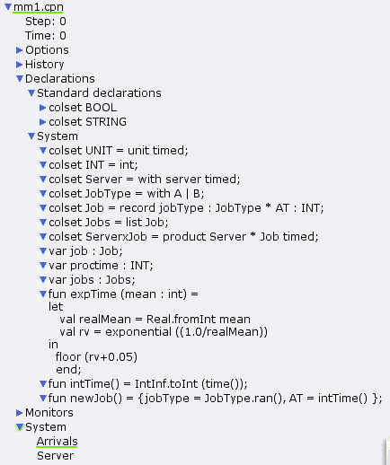
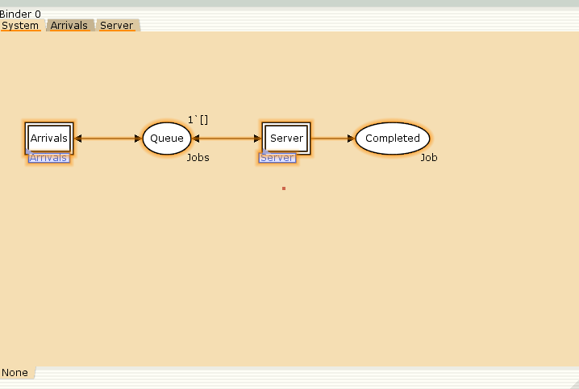
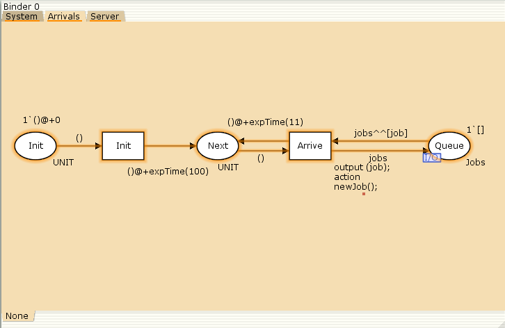
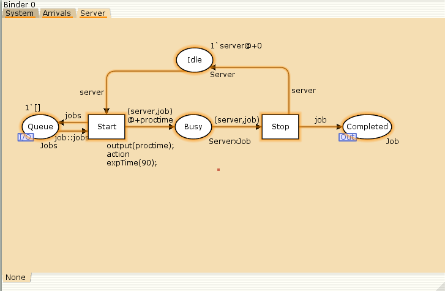
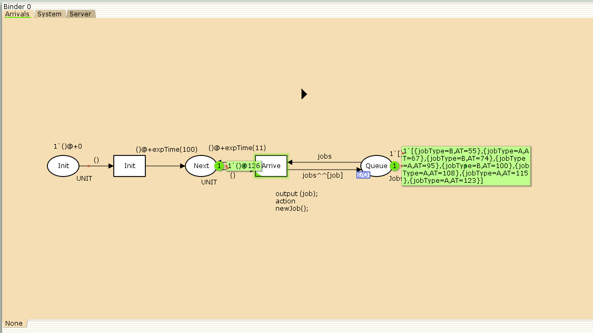
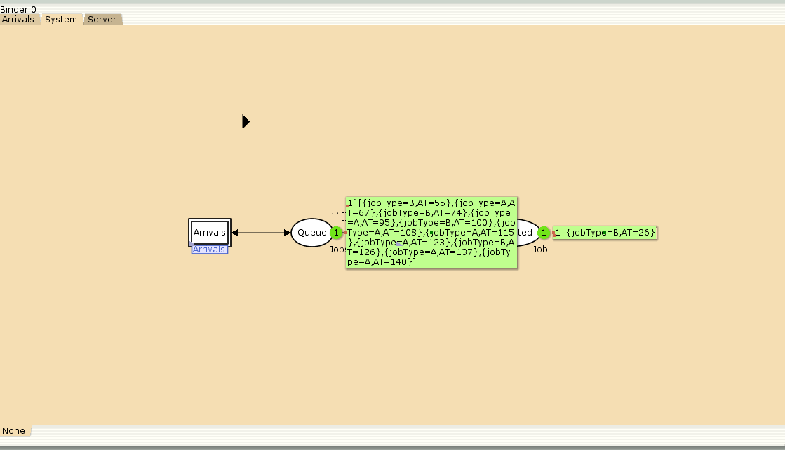
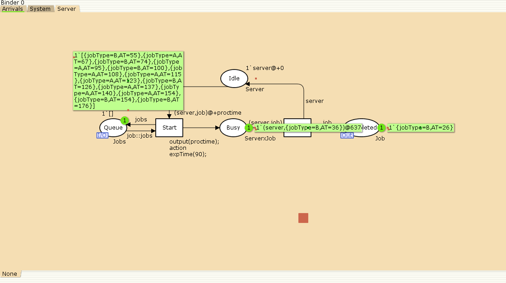
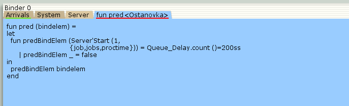
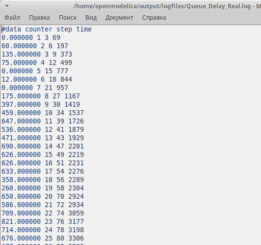
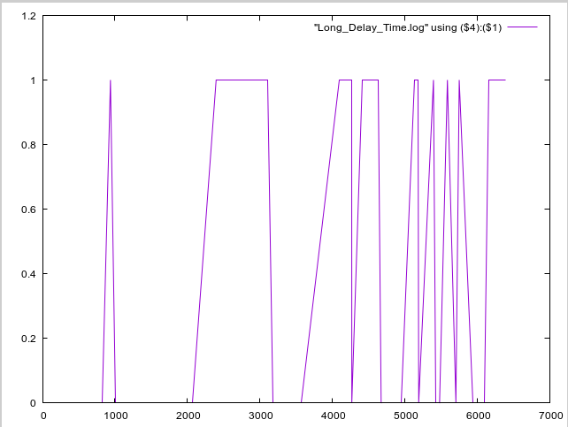

---
## Front matter
lang: ru-RU
title: Лабораторная работа № 11
subtitle: Модель системы массового обслуживания M|M|1
author:
  - Хамдамова Айжана
institute:
  - Российский университет дружбы народов, Москва, Россия
date: 19 апреля 2025

## i18n babel
babel-lang: russian
babel-otherlangs: english

## Formatting pdf
toc: false
toc-title: Содержание
slide_level: 2
aspectratio: 169
section-titles: true
theme: metropolis
header-includes:
 - \metroset{progressbar=frametitle,sectionpage=progressbar,numbering=fraction}
---

# Информация

## Докладчик

:::::::::::::: {.columns align=center}
::: {.column width="70%"}

  * Хамдамова Айжана 
  * студент факультета Физико-математических и естественных наук
  * Российский университет дружбы народов
  * [1032225989@pfur.ru](mailto:1032225989@pfur.ru)
  * <https://github.com/AizhanaKhamdamova/study_2024-2025_simmod>

:::
::: {.column width="30%"}

:::
::::::::::::::

# Вводная часть

## Цели и задачи

- Реализовать в CPN Tools модель системы массового обслуживания M|M|1.
- Настроить мониторинг параметров моделируемой системы и нарисовать графики очереди.

## Постановка задачи
В систему поступает поток заявок двух типов, распределённый по пуассоновскому
закону. Заявки поступают в очередь сервера на обработку. Дисциплина очереди -
FIFO. Если сервер находится в режиме ожидания (нет заявок на сервере), то заявка
поступает на обработку сервером

## Ход работы 
Зададим декларации системы
{width=70%}

## Ход работы

## Ход работы

## Ход работы

## Запуск моделируемой сети

{#fig:019 width=70%}

## Запуск моделируемой 

{#fig:020 width=70%}

## Запуск моделируемой 

{#fig:021 width=70%}

## Ход работы

## Ход работы

## Результат 

## Ход работы

## Ход работы
 
 {width=70%}

## Выводы

В процессе выполнения данной лабораторной работы я реализовала модель системы массового обслуживания $M|M|1$ в CPN Tools.

## Список литературы{.unnumbered}

1. Зайцев Д. А., Шмелева Т. Р. Моделирование телекоммуникационных систем
в CPN Tools. — Одесса : Одесская национальная академия связи им. А.С. Попова,
2008.
2. CPN Tool. — 2014. — URL: http://cpntools.org.
