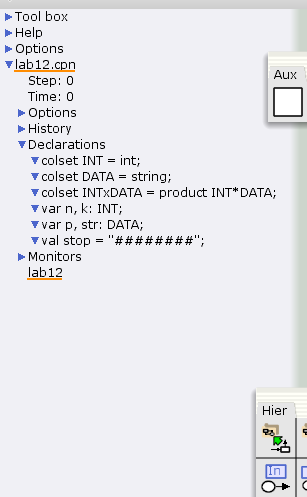
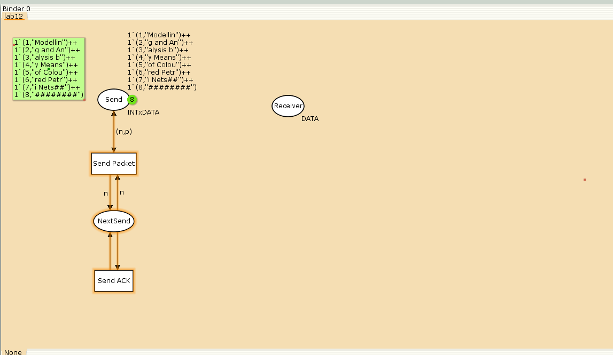
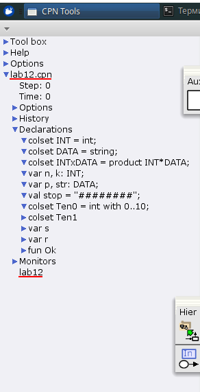
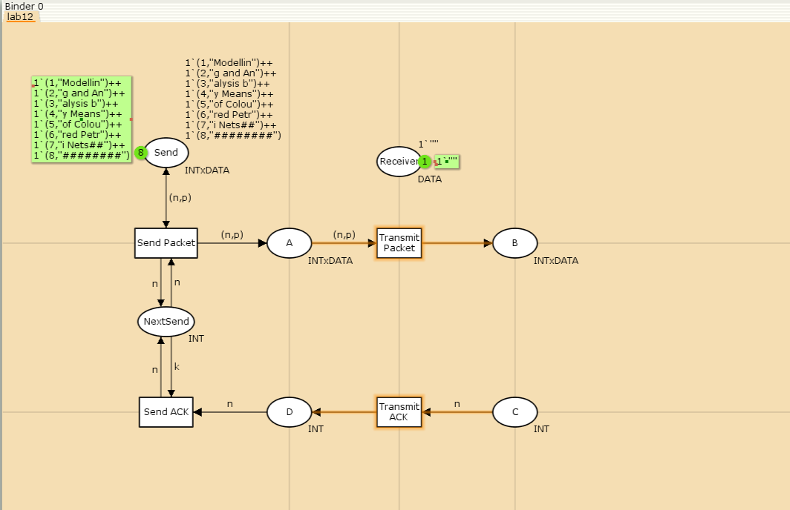
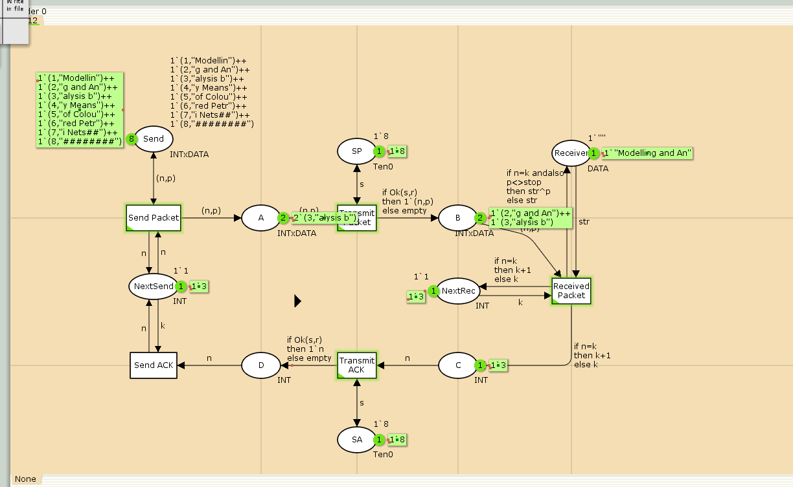
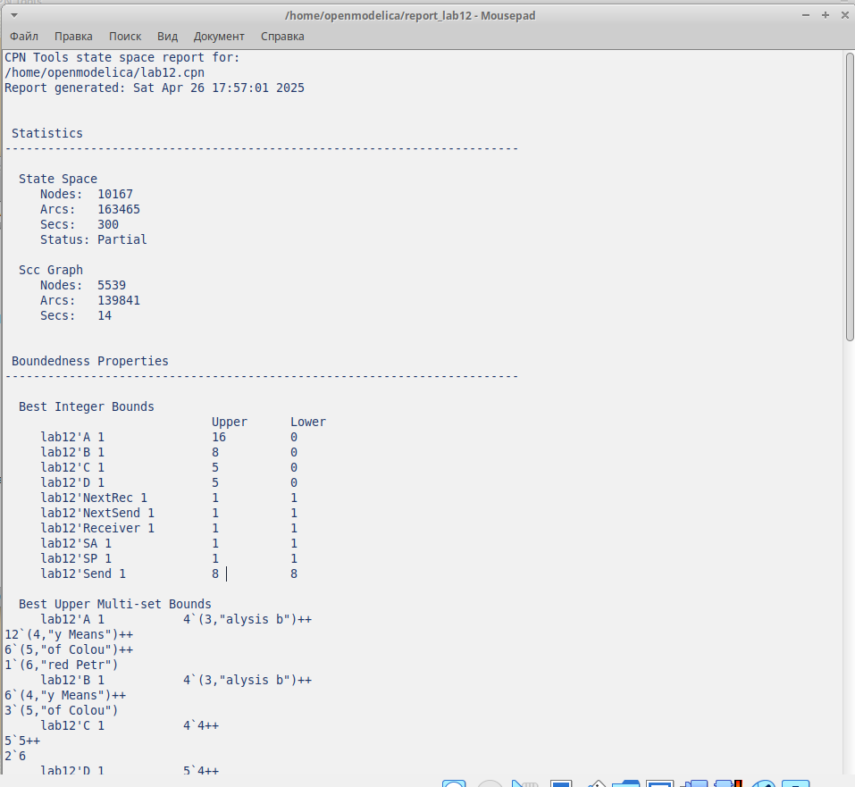
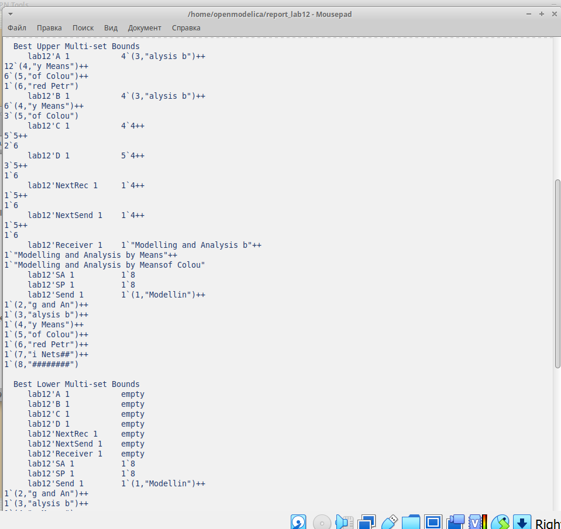
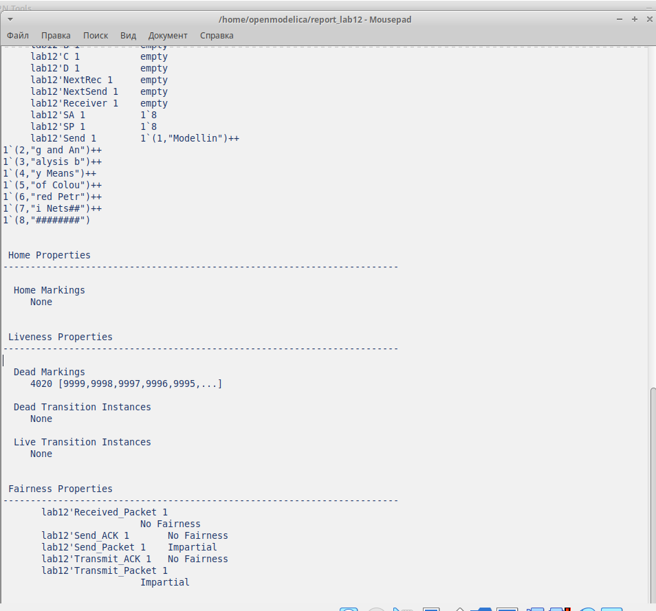
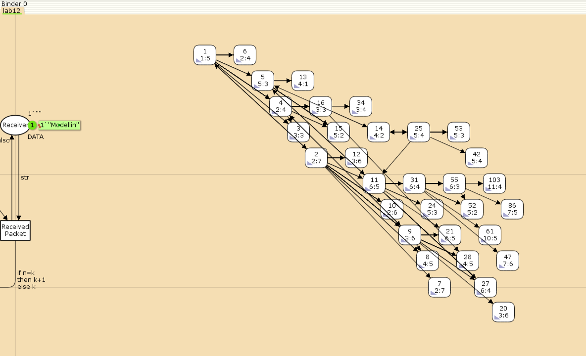

---
## Front matter
lang: ru-RU
title: Лабораторная работа 12
subtitle: Пример моделирования простого протокола передачи данных
author:
  - Хамдамова Айжана
institute:
  - Российский университет дружбы народов, Москва, Россия
date: 26 апреля 2025

## i18n babel
babel-lang: russian
babel-otherlangs: english

## Formatting pdf
toc: false
toc-title: Содержание
slide_level: 2
aspectratio: 169
section-titles: true
theme: metropolis
header-includes:
 - \metroset{progressbar=frametitle,sectionpage=progressbar,numbering=fraction}
---

# Информация

## Докладчик

:::::::::::::: {.columns align=center}
::: {.column width="70%"}

  * Хамдамова Айжана 
  * студент факультета Физико-математических и естественных наук
  * Российский университет дружбы народов
  * [1032225989@pfur.ru](mailto:1032225989@pfur.ru)
  * <https://github.com/AizhanaKhamdamova/study_2024-2025_simmod>

:::
::: {.column width="30%"}

:::
::::::::::::::

## Цель работы

Реализовать простой протокол передачи данных в CPN Tools.

## Задание

- Реализовать простой протокол передачи данных в CPN Tools.
- Вычислить пространство состояний, сформировать отчет о нем и построить граф.

## Выполнение лабораторной работы

{#fig:002 width=60%}

## Выполнение лабораторной работы

{#fig:002 width=60%}

## Выполнение лабораторной работы

{#fig:004 width=60%}

## Выполнение лабораторной работы

{#fig:003 width=60%}

## Выполнение лабораторной работы

{#fig:006 width=60%}

## Упражнение

{#fig:007 width=70%}

## Упражнение

{#fig:008 width=70%}

## Упражнение

{#fig:009 width=70%}

## Упражнение

{#fig:007 width=70%}

## Выводы

В процессе выполнения данной лабораторной работы я реализовала простой протокол передачи данных в CPN Tools и проведен анализ его пространства состояний.

## Список литературы{.unnumbered}

1. Зайцев Д. А., Шмелева Т. Р. Моделирование телекоммуникационных систем
в CPN Tools. — Одесса : Одесская национальная академия связи им. А.С. Попова,
2008.
2. CPN Tool. — 2014. — URL: http://cpntools.org.