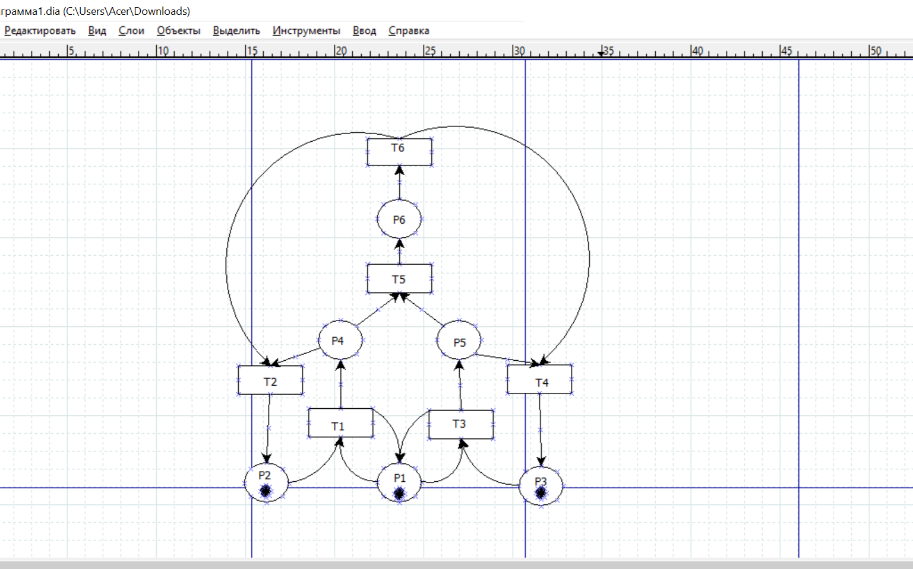
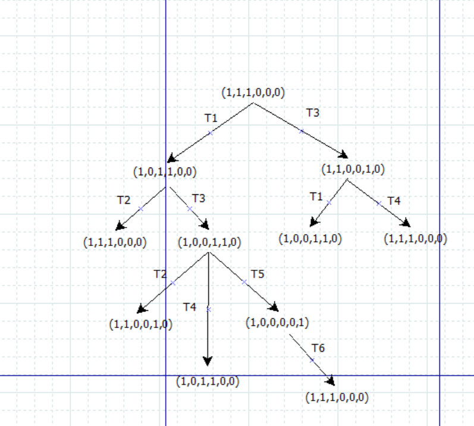
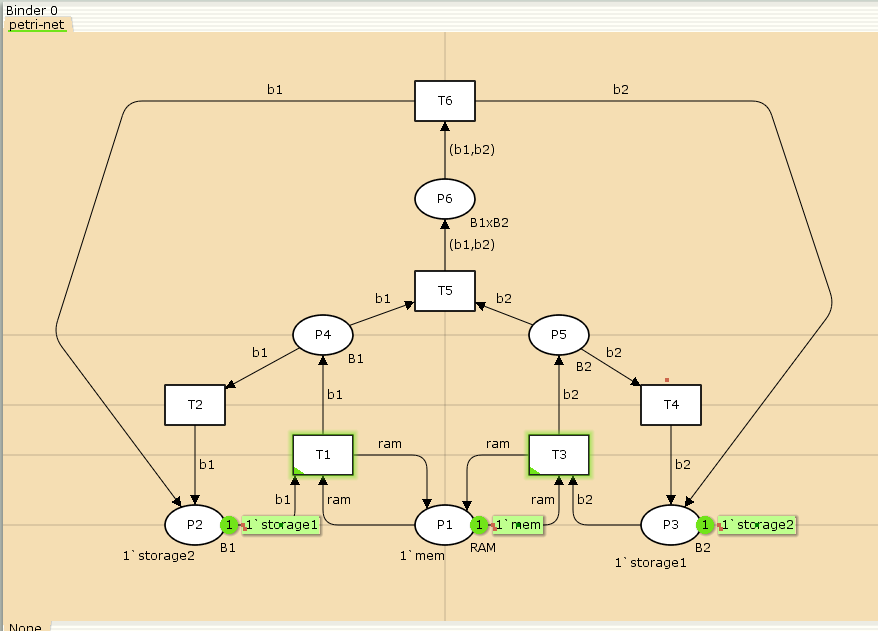
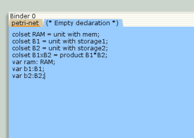
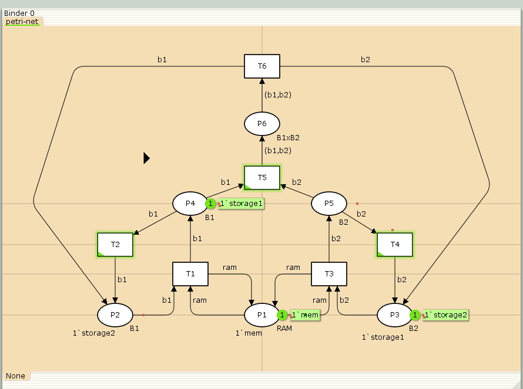
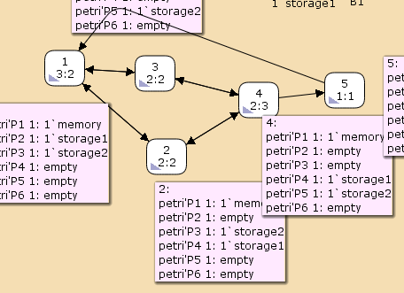

---
## Front matter
lang: ru-RU
title:  Лабораторная работа № 13
subtitle: Задание для самостоятельного выполнения
author:
  - Хамдамова Айжана
institute:
  - Российский университет дружбы народов, Москва, Россия
date: 30 апреля 2025

## i18n babel
babel-lang: russian
babel-otherlangs: english

## Formatting pdf
toc: false
toc-title: Содержание
slide_level: 2
aspectratio: 169
section-titles: true
theme: metropolis
header-includes:
 - \metroset{progressbar=frametitle,sectionpage=progressbar,numbering=fraction}
---

# Информация

## Докладчик

:::::::::::::: {.columns align=center}
::: {.column width="70%"}

  * Хамдамова Айжана 
  * студент факультета Физико-математических и естественных наук
  * Российский университет дружбы народов
  * [1032225989@pfur.ru](mailto:1032225989@pfur.ru)
  * <https://github.com/AizhanaKhamdamova/study_2024-2025_simmod>

:::
::: {.column width="30%"}


:::
::::::::::::::


## Цели и задачи

- Используя теоретические методы анализа сетей Петри, провести анализ сети (с помощью построения дерева достижимости). Определить, является ли сеть безопасной, ограниченной, сохраняющей, имеются ли
тупики.
- Промоделировать сеть Петри с помощью CPNTools.
- Вычислить пространство состояний. Сформировать отчёт о пространстве состояний и проанализировать его.Построить граф пространства состояний.

## Схема модели

Заявка (команды программы, операнды) поступает в оперативную память (ОП), затем
передается на прибор (центральный процессор, ЦП) для обработки. После этого
заявка может равновероятно обратиться к оперативной памяти или к одному из двух
внешних запоминающих устройств (B1 и B2). Прежде чем записать информацию на
внешний накопитель, необходимо вторично обратиться к центральному процессору,
определяющему состояние накопителя и выдающему необходимую управляющую
информацию. Накопители (B1 и B2) могут работать в 3-х режимах:

1) B1 — занят, B2 — свободен;
2) B2 — свободен, B1 — занят;
3) B1 — занят, B2 — занят.

## Описание модели
Множество позиций:

P1 — состояние оперативной памяти (свободна / занята);

P2 — состояние внешнего запоминающего устройства B1 (свободно / занято);

P3 — состояние внешнего запоминающего устройства B2 (свободно / занято);

P4 — работа на ОП и B1 закончена;

P5 — работа на ОП и B2 закончена;

P6 — работа на ОП, B1 и B2 закончена;

Множество переходов:
T1 — ЦП работает только с RAM и B1;

T2 — обрабатываются данные из RAM и с B1 переходят на устройство вывода;

T3 — CPU работает только с RAM и B2;

T4 — обрабатываются данные из RAM и с B2 переходят на устройство вывода;

T5 — CPU работает только с RAM и с B1, B2;

T6 — обрабатываются данные из RAM, B1, B2 и переходят на устройство вывода.

## Описание модели
Функционирование сети Петри можно расматривать как срабатывание переходов,
в ходе которого происходит перемещение маркеров по позициям:

- работа CPU с RAM и B1 отображается запуском перехода T1 (удаление маркеров
из P1, P2 и появление в P1, P4), что влечет за собой срабатывание перехода T2,
т.е. передачу данных с RAM и B1 на устройство вывода;
- работа CPU с RAM и B2 отображается запуском перехода T3 (удаление маркеров
из P1 и P3 и появление в P1 и P5), что влечет за собой срабатывание перехода T4,
т.е. передачу данных с RAM и B2 на устройство вывода;
- работа CPU с RAM, B1 и B2 отображается запуском перехода T5 (удаление
маркеров из P4 и P5 и появление в P6), далее срабатывание перехода T6, и данные
из RAM, B1 и B2 передаются на устройство вывода;
- состояние устройств восстанавливается при срабатывании: RAM — переходов
T1 или T2; B1 — переходов T2 или T6; B2 — переходов T4 или T6.


## Ход работы 

{#fig:001 width=70%}

## Ход работы 

{#fig:002 width=50%}


## Ход работы 

{#fig:007 width=70%}

## Ход работы 

{#fig:004 width=70%}

## Ход работы 

{#fig:005 width=70%}

## Ход работы 
```
CPN Tools state space report for:
/home/openmodelica/petri_net.cpn
Report generated: Sat Jun  1 00:38:28 2024

 Statistics
------------------------------------------------------------------------

  State Space
     Nodes:  5
     Arcs:   10
     Secs:   0
     Status: Full 
```

## Ход работы 

{#fig:006 width=70%}


## Выводы

В результате выполнения данной лабораторной работы я выполнила задание для самостоятельного выполнения, а именно провела анализ сети Петри, построила сеть в CPN Tools, построила граф состояний и провела его анализ.


## Список литературы{.unnumbered}

1. Питерсон Дж. Теория сетей Петри и моделирование
систем: Пер. с англ.  М.: Мир, 1984.
2. Зайцев Д. А., Шмелева Т. Р. Моделирование телекоммуникационных систем
в CPN Tools. — Одесса : Одесская национальная академия связи им. А.С. Попова,
2008.
3. CPN Tool. — 2014. — URL: http://cpntools.org.
4. Лескин А.А. Сети Петри в моделировании и
управлении.  Л.: Наука, 1988
5. Котов В.Е. Сети Петри.  М.: Наука, 1984.