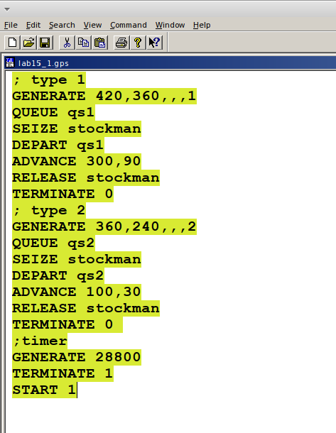
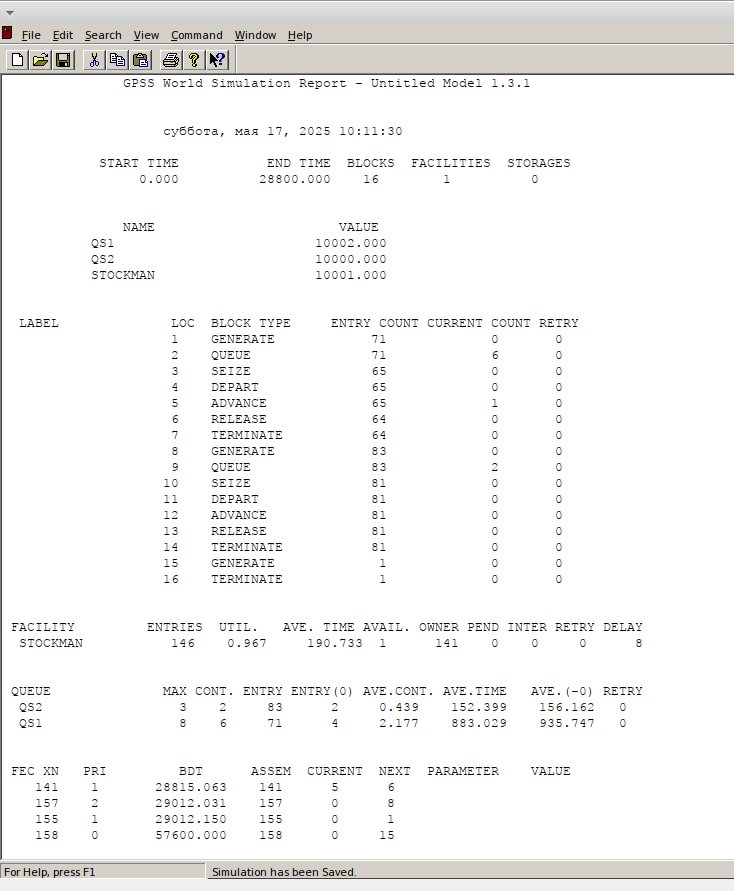
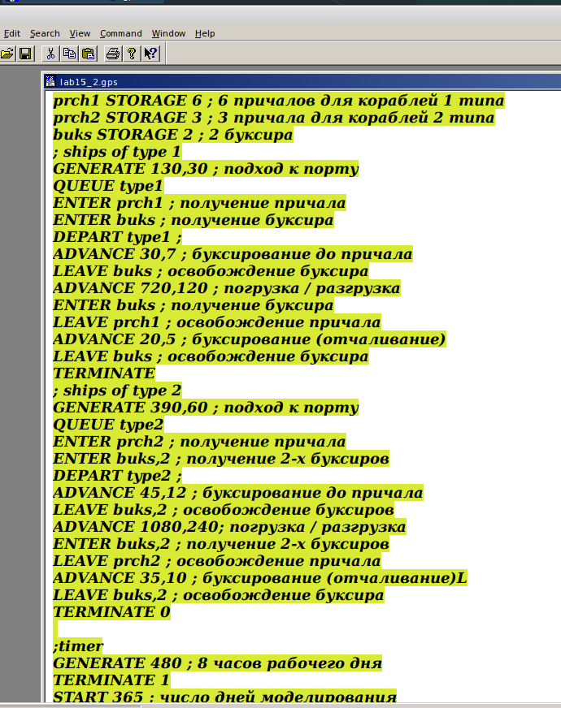
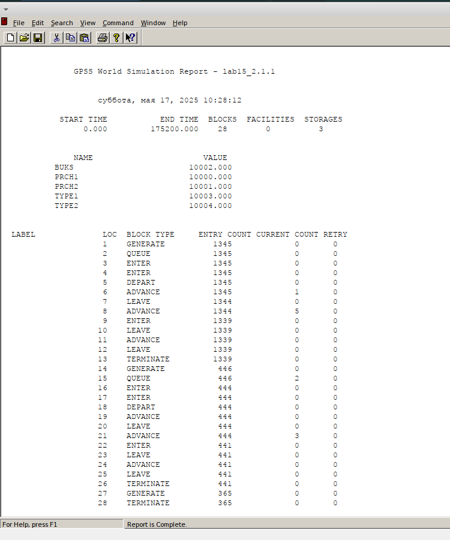
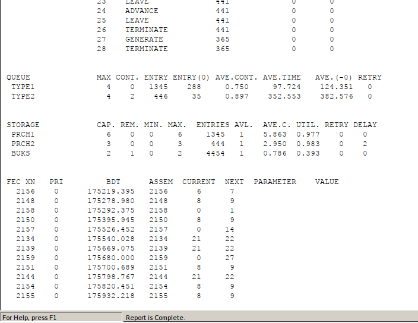

---
## Front matter
lang: ru-RU
title: Лабораторная работа № 15
subtitle: Модели обслуживания с приоритетами
author:
  - Хамдамова Айжана
institute:
  - Российский университет дружбы народов, Москва, Россия
date: 17 мая 2025

## i18n babel
babel-lang: russian
babel-otherlangs: english

## Formatting pdf
toc: false
toc-title: Содержание
slide_level: 2
aspectratio: 169
section-titles: true
theme: metropolis
header-includes:
 - \metroset{progressbar=frametitle,sectionpage=progressbar,numbering=fraction}
---

# Информация

## Докладчик

:::::::::::::: {.columns align=center}
::: {.column width="70%"}

  * Хамдамова Айжана 
  * студент факультета Физико-математических и естественных наук
  * Российский университет дружбы народов
  * [1032225989@pfur.ru](mailto:1032225989@pfur.ru)
  * <https://github.com/AizhanaKhamdamova/study_2024-2025_simmod>

:::
::: {.column width="30%"}

:::
::::::::::::::

## Цели и задачи 

Реализовать модели обслуживания с приоритетами и провести анализ результатов.

Реализовать с помощью gpss:

- Модель обслуживания механиков на складе
- Модель обслуживания в порту судов двух типов

# Выполнение лабораторной работы

## Модель обслуживания механиков на складе

На фабрике на складе работает один кладовщик, который выдает запасные части механикам, обслуживающим станки. Время, необходимое для удовлетворения запроса, зависит от типа запасной части.Запросы бывают двух категорий. Для первой
категории интервалы времени прихода механиков $420 \pm 360$ сек., время обслуживания -- $300 \pm 90$ сек. Для второй категории интервалы времени прихода механиков $360 \pm 240$ сек., время обслуживания -- $100 \pm 30$ сек
Порядок обслуживания механиков кладовщиком такой: запросы первой категории обслуживаются только в том случае, когда в очереди нет ни одного запроса второй категории. Внутри одной категории дисциплина обслуживания -- "первым пришел -- первым обслужился". Необходимо создать модель работы кладовой, моделирование выполнять в течение восьмичасового рабочего дня.

## Ход работы 

## Ход работы 

## Модель обслуживания в порту судов двух типов

Морские суда двух типов прибывают в порт, где происходит их разгрузка. В порту есть два буксира, обеспечивающих ввод и вывод кораблей из порта. К первому типу судов относятся корабли малого тоннажа, которые требуют использования одного буксира. Корабли второго типа имеют большие размеры, и для их ввода и вывода из порта требуется два буксира. Из-за различия размеров двух типов кораблей необходимы и причалы различного размера. Кроме того, корабли имеют различное время погрузки/разгрузки. 

Требуется построить модель системы, в которой можно оценить время ожидания кораблями каждого типа входа в порт. Время ожидания входа в порт включает время ожидания освобождения причала и буксира. Корабль, ожидающий освобождения причала, не обслуживается буксиром до тех пор, пока не будет предоставлен нужный причал. Корабль второго типа не займёт буксир до тех пор, пока ему не будут доступны оба буксира.

## Ход работы 

## Ход работы 

## Ход работы 

## Выводы

В результате выполнения работы были реализованы с помощью gpss:

- Модель обслуживания механиков на складе;
- Модель обслуживания в порту судов двух типов.

## Список литературы{.unnumbered}

1. АлтаевА.А.ИмитационноемоделированиенаязыкеGPSS —Улан-Удэ:Изд-во ВСГТУ, 2001. — 122 с.
2. Советов Б. Я., Яковлев С. А. Моделирование систем. Практикум: учеб. пособие для вузов. — 2-е, перераб. и доп. — М. : Высш. шк., 2003. —295с.
3. Имитационное и статистическое моделирование / В. И. Лобач, В П. Кирлица, В. И. Малюгин, С. Н. Сталевская. — Мн. : БГУ, 2004.— 189 с.
4. Шевченко Д. Н., Кравченя И. Н. Имитационное моделирование на GPSS : учеб. метод. пособие для студентов технических специальностей. — Гомель : БелГУТ, 2007. — 97 с.

