---
## Front matter
lang: ru-RU
title: Лабораторная работа № 17
subtitle: Задания для самостоятельной работы
author:
  - Хамдамова Айжана
institute:
  - Российский университет дружбы народов, Москва, Россия
date: 17 мая 2025

## i18n babel
babel-lang: russian
babel-otherlangs: english

## Formatting pdf
toc: false
toc-title: Содержание
slide_level: 2
aspectratio: 169
section-titles: true
theme: metropolis
header-includes:
 - \metroset{progressbar=frametitle,sectionpage=progressbar,numbering=fraction}
---

# Информация

## Докладчик

:::::::::::::: {.columns align=center}
::: {.column width="70%"}

  * Хамдамова Айжана 
  * студент факультета Физико-математических и естественных наук
  * Российский университет дружбы народов
  * [1032225989@pfur.ru](mailto:1032225989@pfur.ru)
  * <https://github.com/AizhanaKhamdamova/study_2024-2025_simmod>

:::
::: {.column width="30%"}

:::
::::::::::::::

# Цели и задачи 

Реализовать с помощью gpss модели работы вычислительного центра, аэропорта и морского порта.

А именно реализовать с помощью gpss:

- модель работы вычислительного центра;
- модель работы аэропорта;
- модель работы морского порта.

# Выполнение лабораторной работы
# Моделирование работы вычислительного центра
## Моделирование работы вычислительного центра

На вычислительном центре в обработку принимаются три класса заданий А, В и С. Исходя из наличия оперативной памяти ЭВМ задания классов А и В могут решаться одновременно, а задания класса С монополизируют ЭВМ. Задачи класса С загружаются в ЭВМ, если она полностью свободна. Задачи классов А и В могут дозагружаться к решающей задаче. 

Смоделируем работу ЭВМ за 80 ч. и определим её загрузку.

## Ход работы 

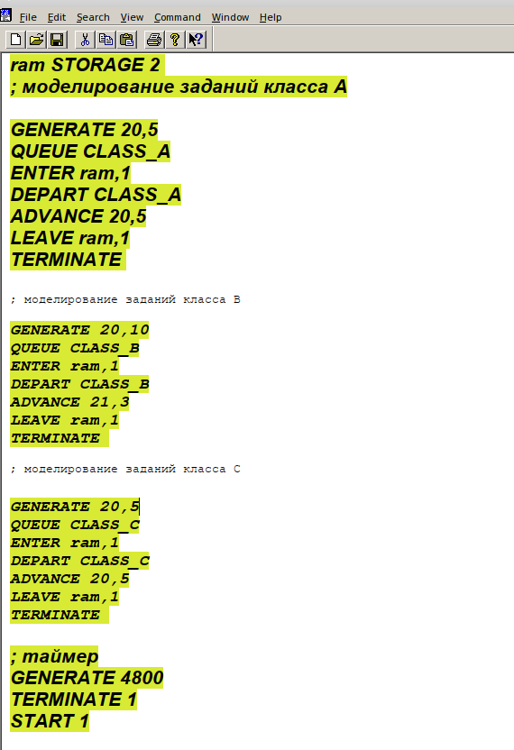{#fig:001 width=60%}

## Ход работы 

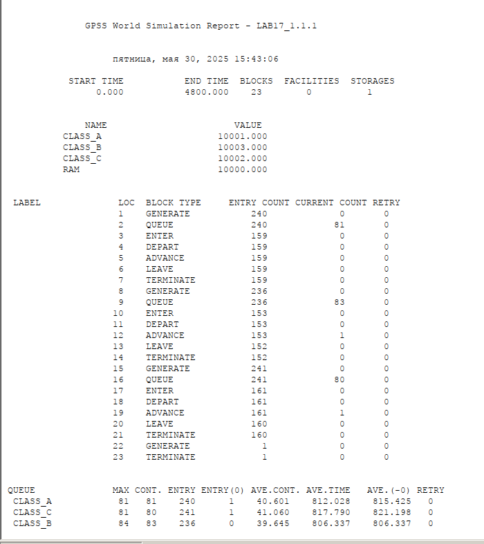{#fig:002 width=70%}

## Ход работы 

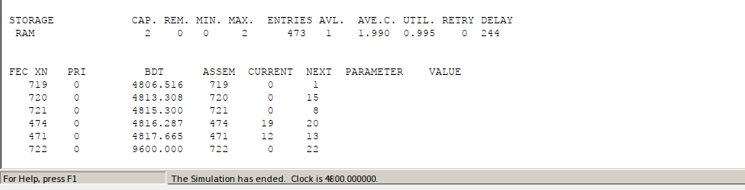{#fig:003 width=70%}

# Модель работы аэропорта

## Модель работы аэропорта

Самолёты прибывают для посадки в район аэропорта каждые $10 \pm 5$ мин. Если взлетно-посадочная полоса свободна, прибывший самолёт получает разрешение на посадку. Если полоса занята, самолет выполняет полет по кругу и возвращается в аэропорт каждые 5 мин. Если после пятого круга самолет не получает разрешения на посадку, он отправляется на запасной аэродром.

В аэропорту через каждые $10 \pm 2$ мин к взлетно -посадочной полосе выруливают готовые к взлёту самолёты и получают разрешение на взлёт, если полоса свободна. Для взлета и посадки самолёты занимают полосу ровно на 2 мин. Если при свободной полосе одновременно один самолёт прибывает для посадки, а другой -- для взлёта, то полоса предоставляется взлетающей машине.

Требуется:

- выполнить моделирование работы аэропорта в течение суток;
- подсчитать количество самолётов, которые взлетели, сели и были направлены на запасной аэродром;
- определить коэффициент загрузки взлетно-посадочной полосы.

## Ход работы

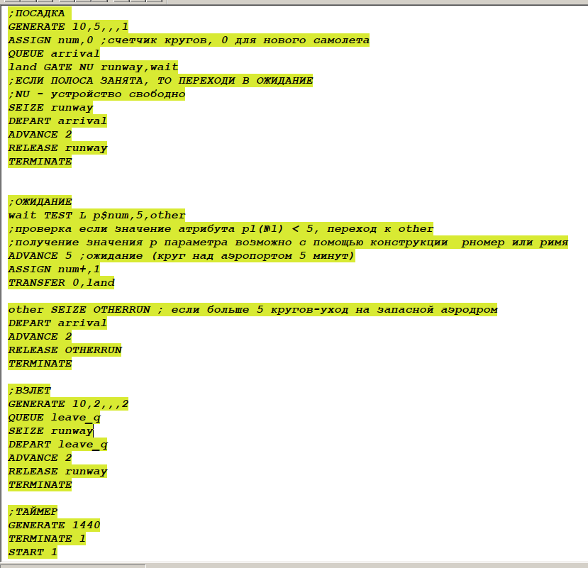{#fig:004 width=70%}

## Ход работы
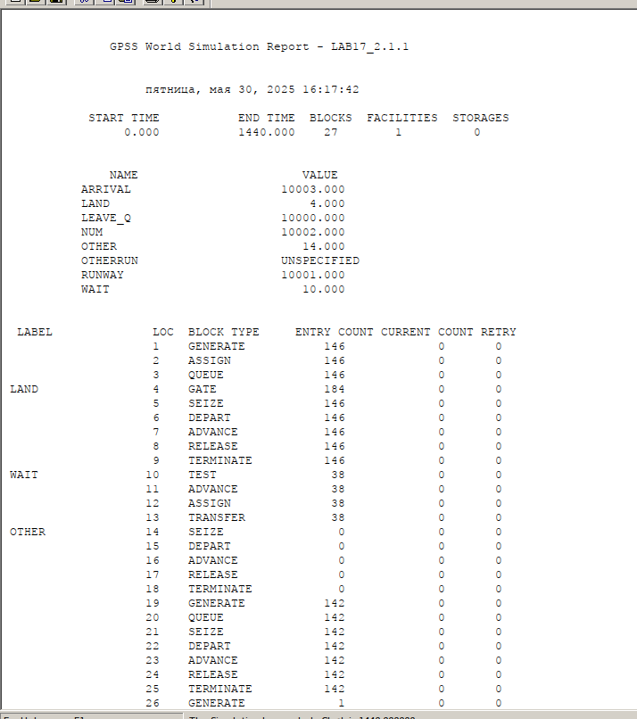{#fig:005 width=90%}

## Ход работы

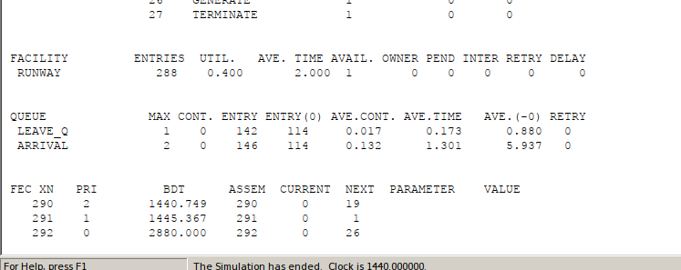{#fig:006 width=90%}

# Моделирование работы морского порта

## Моделирование работы морского порта

Морские суда прибывают в порт каждые $[\alpha \pm \delta]$ часов. В порту имеется N причалов. Каждый корабль по длине занимает M причалов и находится в порту $[b \pm \varepsilon]$ часов.
Требуется построить GPSS-модель для анализа работы морского порта в течение полугода, определить оптимальное количество причалов для эффективной работы порта.
Рассмотрим два варианта исходных данных:
1) $a = 20$ ч, $\delta = 5$ ч, $b = 10$ ч, $\varepsilon = 3$ ч, $N = 10$, $M = 3$;
2) $a = 30$ ч, $\delta = 10$ ч, $b = 8$ ч, $\varepsilon = 4$ ч, $N = 6$, $M = 2$.

## Ход работы. Модель для первого варианта

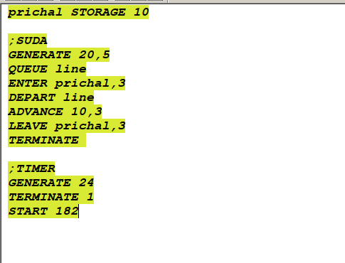{#fig:007 width=70%}

## Ход работы. Модель для первого варианта

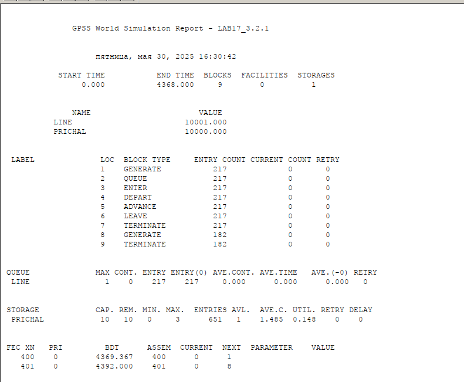{#fig:008 width=90%}

## Ход работы

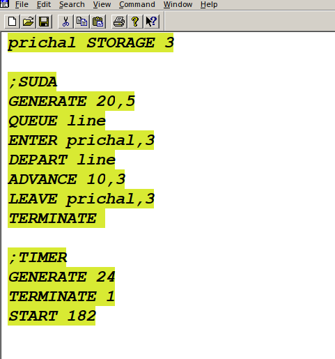{#fig:009 width=90%}

## Ход работы

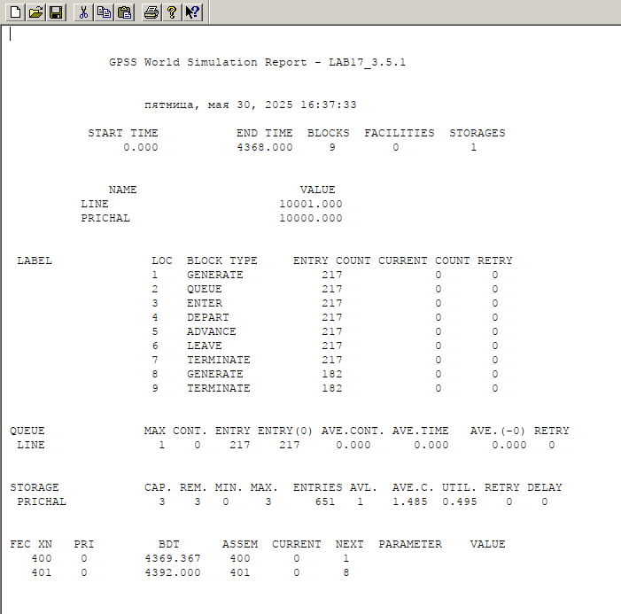{#fig:010 width=90%}

## Ход работы. Второй вариант модели

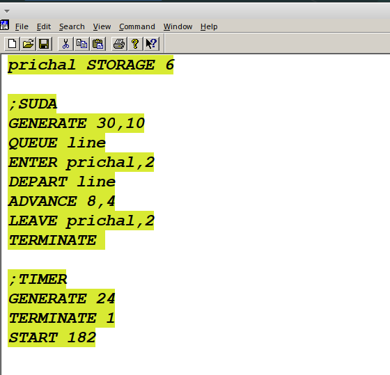{#fig:011 width=70%}

## Ход работы. Второй вариант модели

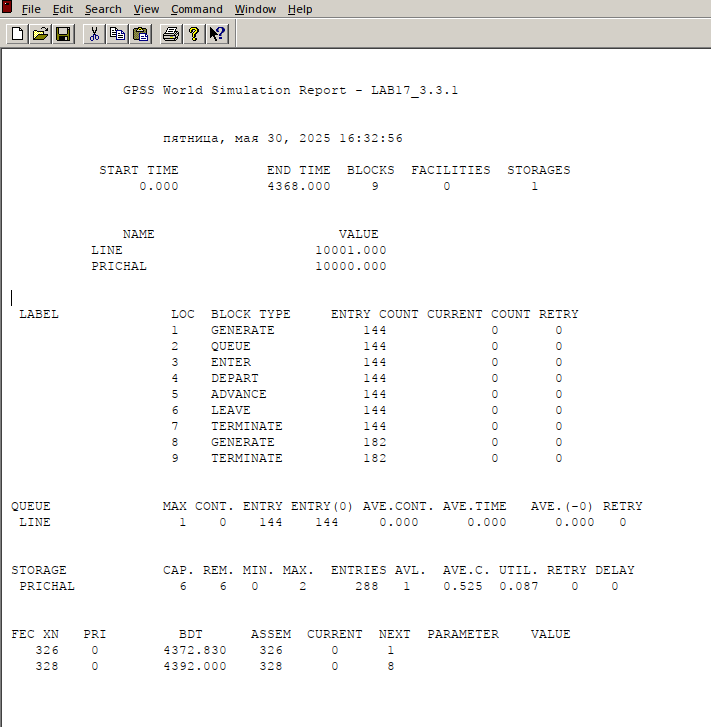{#fig:012 width=90%}

## Ход работы.

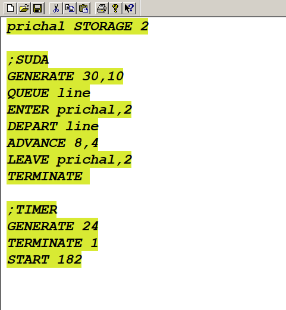{#fig:013 width=90%}

## Ход работы.

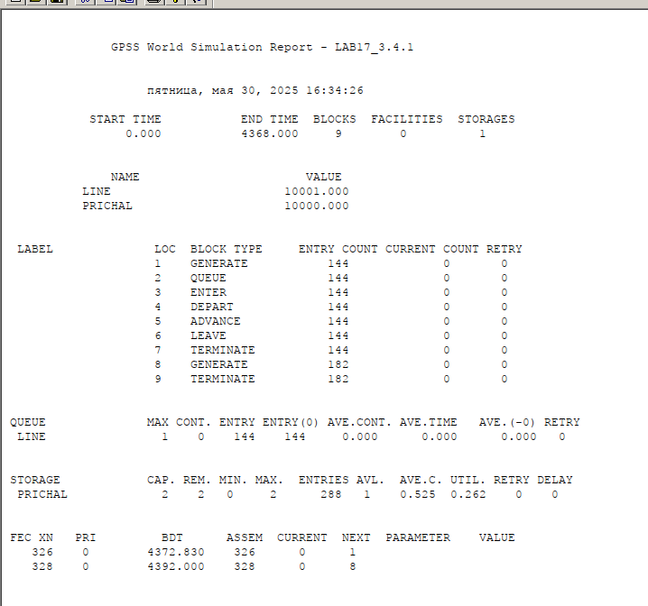{#fig:014 width=90%}

# Выводы

В результате выполнения данной лабораторной работы я реализовала с помощью gpss:

- модель работы вычислительного центра;
- модель работы аэропорта;
- модель работы морского порта.

## Список литературы{.unnumbered}

1. АлтаевА.А.ИмитационноемоделированиенаязыкеGPSS —Улан-Удэ:Изд-во ВСГТУ, 2001. — 122 с.
2. Советов Б. Я., Яковлев С. А. Моделирование систем. Практикум: учеб. пособие для вузов. — 2-е, перераб. и доп. — М. : Высш. шк., 2003. —295с.
3. Имитационное и статистическое моделирование / В. И. Лобач, В П. Кирлица, В. И. Малюгин, С. Н. Сталевская. — Мн. : БГУ, 2004.— 189 с.
4. Шевченко Д. Н., Кравченя И. Н. Имитационное моделирование на GPSS : учеб. метод. пособие для студентов технических специальностей. — Гомель : БелГУТ, 2007. — 97 с.